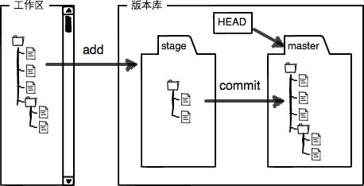

# Git常用命令


#### 参考

> [廖学峰官方网站](https://www.liaoxuefeng.com/wiki/896043488029600)
>
> [工作中 99% 能用到的 Git 命令](http://mp.weixin.qq.com/s?__biz=MzAxNjk4ODE4OQ==&mid=2247487283&idx=2&sn=0e726185ef62f04f3510b19f77e360ef&chksm=9bed2e41ac9aa757923892cffff3de6cf81b9c266227cf8a560c9c40371560674688ec8100dc&scene=0&xtrack=1#rd)
>
> [Git官方文档]( https://git-scm.com/doc )


#### Git理论

Git本地有三个工作区域：工作目录（Working Directory），暂存区（Stage/Index），资源库（Repository）如果加上远程的git仓库，就可以分为四个工作区域

* 工作区：就是平时存放项目代码的地方
* 暂存区：用来存放你的改动，本质上就是个文件
* 资源库：就是安全存放的地方


#### 初始化配置

```shell
$ git config --list       # 列出所有配置信息
# 配置提交用户的用户名和邮箱
$ git config --global user.name "Your Name"
$ git config --global user.email "email@example.com"
$ git config --global color.ui true
```

* 其中Youname和email@example.com换成要用的用户名和密码，git每一次记录修改的时候都要使用这两个东西

* 最后一条配置git显示颜色

* 配置完之后会在用户家目录出现一个.gitconfig的文件，就是上面配置的内容


#### 创建版本库

```shell
$ mkdir learngit
$ cd learngit
$ git init
# 此时会在当前目录生成一个.git的目录，这个目录记录了每一次修改
```

将文件及修改写入版本库：

```shell
$ git add readme.txt
$ git commit -m "wrote a readme file"
$ git commit --amend 
或者
$ git commit --amend -m "说明"

# 忽略文件，在.git同级目录下新建.gitignore文件
# .gitignore内容

*.txt				# 忽略所有的txt文件
!config.txt			# 除了config.txt文件
/tmp				# 忽略tmp目录
target/*.iml		# 忽略target目录下的所有iml文件
```

* 第一个命令是将文件放入stage（还没上传到版本库），第二条命令就是将stage的所有内容写入到版本库，并且使用-m带上说明
* 第三条命令可以更正提交说明


#### 回退

```shell
$ git status
# 这个命令用来查看当前的状态（有没有文件修改了没有写入到cache，有没有文件没有写入版本库）
```

```shell
$ git checkout -- <file>
# 使用版本库的文件还原当前目录的文件，也可以使用:
$ git diff readme.txt
$ git diff 快照ID 快照ID
$ git diff 快照ID
$ git diff --cached
# 第二个命令比较两个快照
# 第三个命令比较当前工作目录和指定快照的区别
# 第四个命令比较暂存区域和仓库的区别
```

```shell
$ git log
$ git log --pretty=oneline      // 用来把所有显示显示为一行
/* 
查看版本记录，会有上传用户及其email的记录，还有上传时间，同时会生成一个commit id（用来做时间回退，有点像 vmware的快照）注意：这里显示的只是当前版本到之前版本的记录，如果之前回到某个版本就不能看到后面的记录
* /
```

```shell
$ git reset --hard HEAD^
$ git reset --hard HEAD~          # 和^差不多
$ git reset --hard HEAD~10      # 相当于10个波浪线
$ git reset --soft HEAD~           # 移动HEAD的指向
$ git reset --mixed HEAD~   # 将快照回滚到暂存区域，默认
$ git reset --hard HEAD~     # 将暂存区域还原到工作目录
$ git reset --hard <commit id>
$ git reflog
/*
第一条命令用来回退到上一个版本，其中HEAD指向当前版本，HEAD^就是上一个版本，也可以用HEAD^^回退到上上个版本。第二条命令就是使用commit id回退。最后那条就是用来查看你处于的版本记录（会显示commit id）
*/

$ git revert HEAD~3
/*
还原第四次前的提交，并在还原更改后创建一次新的提交
*/
```

```shell
/*
如果你发现你在工作区的文件写了些像stupid boss这些东西的话就要用下面这个命令撤销掉这个文件的修改（不怕死可以不改）
*/

$ git checkout -- <file>

# 使用某个commit的指定文件来恢复暂存区和工作区的同名文件
$ git checkout [commit] [file]

/*
如果很不幸你提交到stage的话，可以用下面这个命令把stage的文件撤销掉
*/

$ git reset HEAD <file>

/*
如果要删除文件，使用下面这个命令删除文件
*/

$ git rm readme.txt      // -f参数强制删除

# 修改文件名和移动文件，加上路径就是移动文件
$ git mv readme.txt readme.md     // Linux用mv，windows用ren

# 取消对制定文件的跟踪（从暂存区拿出来）
$ git rm --cached <file>
```


#### git提交结构（workspace，stage，master）：




#### 远程仓库

```shell
/* 
首先要在本地生成ssh key，并且加到你的github的ssh设置那里，不然你的电脑连不上。
然后再github上建立一个仓库，然后就会出现一些命令，就是用来给你克隆这个残酷到本地的
*/

$ 在项目中添加一个远程仓库
$ git remote add origin git.michaelliao/learngit.git
$ git remote add new git.michaelliao/studygit.git

# 推送本地到远程仓库
$ git push -u origin master

# 使用远程仓库更新本地
$ git pull origin master
$ git pull origin next   # 拉取远程分支next合并到当前分支

# 推送本地到远端origin
$ git push origin

# 查看项目和那些远端仓库相连
$ git remote
$ git remote -v

# 拉取远端仓库到暂存区
$ git fetch

# git clone的做法
$ mkdir project.git
$ cd project.git
$ git init
$ git remote add -f -t master -m master来源git：//example.com/git.git/
$ git merge origin
```


#### 分支管理

```shell
# 创建分支：
$ git branch dev
$ git branch -r    # 查看远程所有的分支
$ git checkout -b dev     # 创建dev分支并移动到dev分支

# checkout加上-b参数就是创建加移动到这个分支，相当于：
$ git branch dev
$ git checkout dev

/*
如果用git checkout -b 不加上分支名会创建匿名分支，匿名分支所做的任何提交无效（可以用来做实验）
*/

# 查看当前分支
$ git branch


# 合并分支：
$ git checkout master
$ git merge dev		# 合并dev分支到master分支

# 删除分支：
$ git branch -d dev

# 使用git log查看分支合并情况
$ git log --graph --pretty=oneline --abbrev-commit
# --graph 用来显示分支图
# --pretty=oneline显示一行

$ git push --all			# 推送本地所有分支
$ git push origin master	# 推送master分支到origin

# 删除远程的分支
$ git push origin --delete <branch name>
$ git branch -dr <remote/branch>
```


#### 标签管理

```shell
# 打标签：
$ git tag v1.0
# 在当前分支当前版本打一个v1.0的标签

# 查看标签：
$ git tag

# 给一个提交打标签：
$ git tag v0.9 f52c633     # 给f52c633的提交打一个v0.9的标签

# 查看标签信息
$ git show <tag name>

# 制定标签的说明信息：
$ git tag -a <tagname> -m "blablabla…"

# 删除标签：
$ git tag -d v0.1

# 推送标签到远程仓库：
$ git push origin v1.0
$ git push origin v1.0         # 一次性推送全部没有推送的标签

# 删除远程标签：
$ git tag -d v0.9       # 先删除本地
$ git push origin :refs/tags/v0.9           # 在删除远程的

```


#### Git设置http代理

```shell
# 设置http和https代理地址
$ git config --global http.proxy 代理地址
$ git config --global https.proxy 代理地址

# 取消代理
$ git config --global --unset http.proxy
$ git config --global --unset https.proxy

# 查看设置的代理
$ git config --global --get http.proxy
$ git config --global --get https.proxy
```


#### Git设置socks5代理

```shell
# 1080是ssr的本地端口，不是服务器开放的端口
$ git config --global http.proxy 'socks5://127.0.0.1:1080'
$ git config --global https.proxy 'socks5://127.0.0.1:1080'
```


#### 生成SSH密钥

首先查看本地是否已经生成了公钥，有的话直接使用就好了

```shell
$ cd ~/.ssh
$ ls
authorized_keys2  id_dsa       known_hosts
config            id_dsa.pub
```

不存在就要创建了

用下面的命令加上绑定github的邮箱生成SSH key

```shell
$ ssh-keygen -t rsa -b 4096 -C "your_email@example.com"
> Generating public/private rsa key pair.
> Enter a file in which to save the key (/c/Users/you/.ssh/id_rsa):[Press enter]
> Enter passphrase (empty for no passphrase): [Type a passphrase]
> Enter same passphrase again: [Type passphrase again]
```

然后再~/.ssh就生成SSH key了

```shell
$ cat ~/.ssh/id_rsa.pub
ssh-rsa AAAAB3NzaC1yc2EAAAABIwAAAQEAklOUpkDHrfHY17SbrmTIpNLTGK9Tjom/BWDSU
GPl+nafzlHDTYW7hdI4yZ5ew18JH4JW9jbhUFrviQzM7xlELEVf4h9lFX5QVkbPppSwg0cda3
Pbv7kOdJ/MTyBlWXFCR+HAo3FXRitBqxiX1nKhXpHAZsMciLq8V6RjsNAQwdsdMFvSlVK/7XA
t3FaoJoAsncM1Q9x5+3V0Ww68/eIFmb1zuUFljQJKprrX88XypNDvjYNby6vw/Pb0rwert/En
mZ+AW4OZPnTPI89ZPmVMLuayrD2cE86Z/il8b+gw3r3+1nKatmIkjn2so1d01QraTlMqVSsbx
NrRFi9wrf+M7Q== schacon@mylaptop.local
```

---


# 工作中 99% 能用到的 Git 命令


## 分支操作

1. git branch 创建分支
2. git branch -b 创建并切换到新建的分支上
3. git checkout 切换分支
4. git branch 查看分支列表
5. git branch -v 查看所有分支的最后一次操作
6. git branch -vv 查看当前分支
7. git brabch -b 分支名 origin/分支名 创建远程分支到本地
8. git branch --merged 查看别的分支和当前分支合并过的分支
9. git branch --no-merged 查看未与当前分支合并的分支
10. git branch -d 分支名 删除本地分支
11. git branch -D 分支名 强行删除分支
12. git branch origin :分支名 删除远处仓库分支
13. git merge 分支名 合并分支到当前分支上


## 暂存操作

1. git stash 暂存当前修改
2. git stash apply 恢复最近的一次暂存
3. git stash pop 恢复暂存并删除暂存记录
4. git stash list 查看暂存列表
5. git stash drop 暂存名(例：stash@{0}) 移除某次暂存
6. git stash clear 清除暂存


## 回退操作

1. git reset --hard HEAD^ 回退到上一个版本
2. git reset --hard ahdhs1(commit_id) 回退到某个版本
3. git checkout -- file撤销修改的文件(如果文件加入到了暂存区，则回退到暂存区的，如果文件加入到了版本库，则还原至加入版本库之后的状态)
4. git reset HEAD file 撤回暂存区的文件修改到工作区


## 标签操作

1. git tag 标签名 添加标签(默认对当前版本)
2. git tag 标签名 commit_id 对某一提交记录打标签
3. git tag -a 标签名 -m '描述' 创建新标签并增加备注
4. git tag 列出所有标签列表
5. git show 标签名 查看标签信息
6. git tag -d 标签名 删除本地标签
7. git push origin 标签名 推送标签到远程仓库
8. git push origin --tags 推送所有标签到远程仓库
9. git push origin :refs/tags/标签名 从远程仓库中删除标签


## 常规操作

1. git push origin test 推送本地分支到远程仓库
2. git rm -r --cached 文件/文件夹名字 取消文件被版本控制
3. git reflog 获取执行过的命令
4. git log --graph 查看分支合并图
5. git merge --no-ff -m '合并描述' 分支名 不使用Fast forward方式合并，采用这种方式合并可以看到合并记录
6. git check-ignore -v 文件名 查看忽略规则
7. git add -f 文件名 强制将文件提交


## git创建项目仓库

1. git init 初始化
2. git remote add origin url 关联远程仓库
3. git pull
4. git fetch 获取远程仓库中所有的分支到本地


## 忽略已加入到版本库中的文件

1. git update-index --assume-unchanged file 忽略单个文件
2. git rm -r --cached 文件/文件夹名字 (. 忽略全部文件)


## 取消忽略文件

1. git update-index --no-assume-unchanged file


## 拉取、上传免密码

1. git config --global credential.helper store