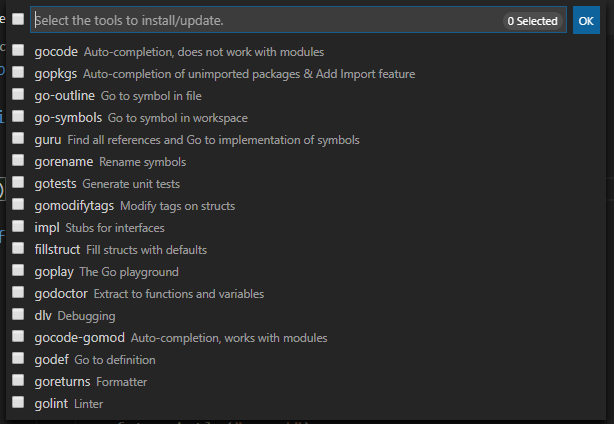

# Go工具

| 工具         | 下载地址                                       |
| ------------ | ---------------------------------------------- |
| gocode       | github.com/mdempsky/gocode                     |
| gopkgs       | github.com/uudashr/gopkgs/v2/cmd/gopkgs        |
| go-outline   | github.com/ramya-rao-a/go-outline              |
| go-symbols   | github.com/acroca/go-symbols                   |
| guru         | golang.org/x/tools/cmd/guru                    |
| gorename     | golang.org/x/tools/cmd/gorename                |
| gotests      | github.com/cweill/gotests/...                  |
| gomodifytags | github.com/fatih/gomodifytags                  |
| impl         | github.com/josharian/impl                      |
| fillstruct   | github.com/davidrjenni/reftools/cmd/fillstruct |
| goplay       | github.com/haya14busa/goplay/cmd/goplay        |
| godoctor     | github.com/godoctor/godoctor                   |
| dlv          | github.com/go-delve/delve/cmd/dlv              |
| gocode-gomod | github.com/stamblerre/gocode                   |
| godef        | github.com/rogpeppe/godef                      |
| goreturns    | github.com/sqs/goreturns                       |
| golint       | golang.org/x/lint/golint                       |

如果`go get <package address>`安装不了直接去github下载下来放在`$GOPATH/src`下，然后执行`go install <package address>`就可以了

golang.org/x/tools/cmd/guru 这种无法访问的网站去github的golang下面下载，比如这个对应的在github的项目就是  https://github.com/golang/tools  下的cmd/guru 把这个项目 pull到 `$GOPATH/src`中对应的 golang.org/x 下再执行`go install <package address>`即可，他会先从本地目录查找有没有对应的如果没有才去远程下载，如果中途还是提示缺少什么库也是去github下下来然后先安装好依赖的包