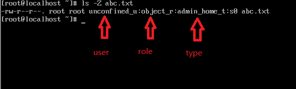
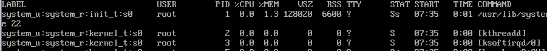

# SELinux简介

> 配置文件位置：/etc/selinux/config，/etc/sysconfig/selinux

```
# getenforce
// 查看selinux当前状态
```

```
// 开启/关闭selinux
# vim /etc/sysconfig/selinux
# 把SELINUX=enforcing改成SELINUX=disabled
# enforcing代表违反selinux策略都会被拒绝
# permissive代表允许操作，但会被记录到log里面
# disabled代表关闭selinux
# SELINUXTYPE=targeted为目标流程保护（默认）
# mls 为多级保护，可以设置保护等级
```

```
# setenforce 0
// 关闭selinux，但不能通过这个命令开启
// 没用
```

SELinux安全上下文

| SYSTEM_U | OBJECT_r | httpd_sys_content_t |
| -------- | -------- | ------------------- |
|          |          |                     |

Policy:策略（控制规则）


安全上下文：

当启动selinux的时候，所有文件和对象都有安全上下文，进程的安全上下文叫做domain

安全上下文由用户:角色:类型展示

1. 系统根据pam子系统的/lib64/security/pam_selinux.so模块设定登陆着运行程序的安全上下文
2. rpm包安装根据rpm包的内记录生成安全上下文
3. 如果手工创建，会根据policy规定生成安全上下文
4. 如果是cp，则会重新生成安全上下文，拷贝的时候，安全上下文会改为目标目录类型
5. 如果是mv，安全上下文不变


安全上下文格式：

安全上下文有user:role:type三部分组成5

* user：类似于系统中的UID，提供身份识别，安全上下文的一部分

三种常见的user

| user_u       | 普通用户登陆到系统后预设   |
| ------------ | -------------------------- |
| system_u     | 开机过程中系统预设，管理员 |
| unconfined_u | 非限制，没有做定义         |

* Role

  文件与目录的role，通差是object_r

  程序的role，通差是system_r

  用户的role，类似于系统的GID，不同的用户角色具备不同的权限，用户可以具备多个role，但是同一时间内只能使用一个role

* type：

  type是将主体语客体划分为不同的组，组每个主体和系统中的客体定义了一个类型，为进程运行提供最低的权限环境


```
# ls -Z <file name>
# ls -Zd <directory name>
// 查看文件的安全上下文
```



```
# ps auxZ
//查看进程的安全上下文
```



```
# chcon -u system_u -r object_r -t samba_share_t abc.txt
# chcon --reference=/etc/passwd aaa.txt
// 设置abc.txt的安全上下文为user=system_u，role=object_r，//type=admin_home_t
// -u [user]：用户
// -r [role]：角色
// -t [type]：类型
// -R：递归处理目录下的文件
// --reference=<file name>：参考指定的文件设置安全上下文
```

```
# restorecon aaa.txt
// 恢复文件的安全上下文
// 恢复安全上下文根据/etc/selinux/targeted/contexts/files/下的文件恢复
// -r | -R：包含子目录和子目录下的文件
// -v：显示详细过程
```

```
# getsebool -a
// 列出本系统所有selinux布尔值（安全策略）
```

```
# setsebool -P tftp_home_dir=on
// 设置指定策略的状态
// -P：代表永久有效
```


### 通过selinux实现ftp匿名登陆上传下载文件：

```
# yum -y install vsftpd
# systemctl start vsftpd.service
# systemctl enable vsftpd.service
// 此时如果开启了selinux，系统用户无法登陆，匿名用户可以登录但不能上传文件
# setsebool -P ftp_home_dir=on
# chmod 777 /etc/ftp/pub
// 修改/etc/vsftpd/vsftpd.conf是匿名用户上传/创建文件，此时还是提示没有上传权限
# setsebool -P ftpd_anon_write=on
# chcon -t public_content_rw_t /var/ftp/pub
// 首先修改策略允许匿名上传，然后该目录的安全上下文打开RW权限
```

