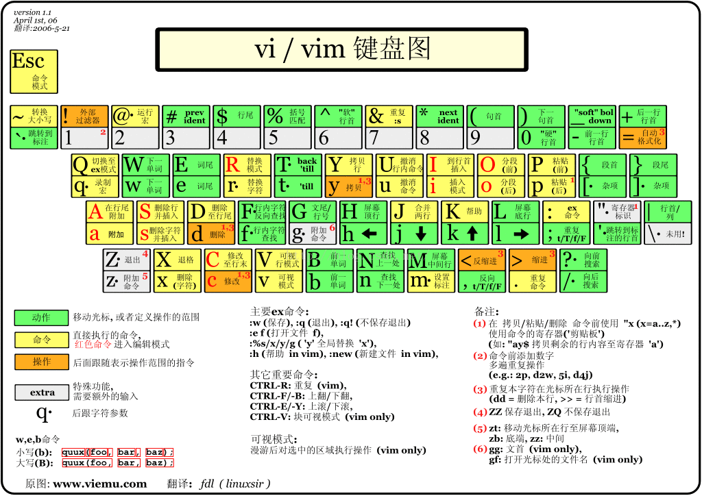

# VIM配置和常用命令





## vim使用方法

### text object

normal模式命令格式

```
[number]<command>[text object] 
```


### 基本操作

normal模式进入insert模式，`i`(insert)，使用这个在字符前面插入、`a`(append)，他会在字符后面插入、`a`是在当前字符的后面插入，`o`(open a line below)，`o`的话会在当前行的下一行插入

还有三个就是上面三个的大写，`I`(insert before line)，它会在当前行的最前面插入、`A`(append after line)，它会在当前行的最后插入、`O`(append a line above)，它会在当前行的上一行插入


`Esc`返回normal模式，normal模式下`:w`是保存修改，`:q`是退出命令，`:wq`是保存退出，`:q!`是不保存强行退出

按住`ctrl+w`之后按方向键或者`h` `i` `j` `k`在不同屏幕间移动


在command模式下使用`:vs [filename]`(vertical split)进行竖直（左右）分屏，使用`:sp [filename]` (split)进行水平（上下）分屏

使用`:%s/foo/bar/g`进行全局替换，`:n,ms/foo/bar/g`在n到m行进行替换，%是匹配全部

`:!<command>`则可以在command模式下执行系统命令

`:set nu`显示行号

`:syntax on`打开代码语法高亮


在normal模式下按v进入visual模式，使用V进行选行，使用`ctrl+v`进行方块选择，在这个模式下使用方向键或者`h` `i` `j` `k`进行批量选择操作，相当于其他编辑器安装`shift+方向键`

normal模式下按下`gi`快速回到上一次编辑的地方插入


在insert模式下，`ctrl+u`删除当前行，`ctrl+w`删除上一个单词，`ctrl+h`删除上一个字符

`ctrl+n`搜索当前文件可以匹配的内容

`ctrl+[`从insert切换到normal模式


### VIM快速移动

在normal模式下：`h`向右，`j`向下，`k`向上，`l`向下

`w`/`W`移动到下一个word/WORD的开头，`e`/`E`移动到下一个word/WORD的结尾 `b`/`B`，回到上一个单词开头，理解为backword（**word代表非空白字符分割的单词，WORD代表空白字符分割的单词**）

在行间搜索字符，`f{char}`跳转到指定字符，使用`;`和`,`移动到下一个和上一个，`t{char}`则是跳转到char的前一个字符，`F{char}`向前搜索

在行之间用`0`移动到当前行的第一个字符，使用`^`移动到当前行的第一个非空白字符。使用`$`移动到当前行的末尾，`g_`移动到行尾非空白字符

使用`(` `)`在句子间移动，使用`{` `}`在段落间移动（用的不多，**中文和英文也不同**）

使用`gg`在任意位置移动到文件开头，使用`G`在任意位置移动到文件结尾，使用`ctrl+o`回退上一步

`H`/`M`/`L`分别跳转到屏幕的开头(head)、中间(middle)、末尾(lower)

`ctrl+u`/`ctrl+d`上下翻半页，`ctrl+f`/`ctrl+b`上下翻一页，`zz`定位到文件中间位置

使用`ctrl+e`/`ctrl+y把文件向上/向下对齐屏幕`


如果跳转到一个地方想回去使用`ctrl+o`回退到跳转列表前一项，使用`ctrl+i`向前跳


### VIM增删改查

直接进入insert模式编辑


在normal模式下使用`dh`或者`x`删除一个字符，使用`dw`(delete word)删除一个单词，使用`dd`删除一行，h、w、d戴代表文本对象，也可以配合数字执行多次

使用`dt{char}`(delete to char)来删除直到指定字符char


在要修改的字符上面使用`r{char}`(replace)将字符替换成char，使用`R`会向后替换

在要修改的字符上面按下`s`(substitute)之后会删除当前字符并且进入insert模式，使用`S`会删除整行并进入insert模式

使用`c`(change)配合文本对象可以实现上述的功能，`cw`删除单词进入插入模式，`C`删除整行然后插入


在command模式下使用`:/{word}`或者`:?{word}`向后和向前搜索word，之后可以使用`n`移动到下一个，使用`N`移动到上一个，然后使用`:/{word} -r`或者`:?{word} -r`取消高亮。如果没有高亮，在command模式下输入`:set hls`显示搜索高亮


### VIM搜索替换

subsitute命令查找并替换文本，而且支持正则表达式

```
:[range]s[ubstitute]/{pattern}/{string}/{flags}
```

* range表示范围，10, 20表示匹配替换10-20行，%表示全部
* pattern是要替换的模式，string是替换后的文本
* flags表示替换的标志
  * g(global)表示全局范围内执行
  * c(confirm)表示确认，可以确认或者拒绝修改
  * n(number)报告匹配到的次数而不替换，可以用来查询匹配次数


### VIM多文件操作

在normal模式下使用`:e {filename}`打开编辑文件

在每打开一个文件都会生成这个文件的缓冲区，使用`:ls`列举当前的缓冲区，使用`:b {n}`跳转到第n个缓冲区，使用`:bn`跳转到下一个缓冲区，使用`:bp`跳转到上一个缓冲区，`:bf` `:bl`分别跳转到第一和最后一个缓冲区，也可以跟buffer名，一般就是文件名来跳转


如果要同时打开多个文件，使用`<ctrl+w>s`水平分割，`<ctrl+w>v`垂直分割，或者在normal模式下执行`:sp` 和 `:vs`

使用`<ctrl+w>w`在窗口间循环切换，使用`<ctrl+w>[hjkl]`在窗口间向左、下、上、右切换

使用`<ctrl+w>[HJKL]`将窗口向左、下、上、右移动

`<ctrl+w>=`使所有窗口等宽登高

`<ctrl+w>_`最大化活动窗口的高度

`<ctrl+w>|`最大化活动窗口的宽度

`[N]<ctrl+w>_`设置活动窗口高度为N行

`[N]<ctrl+w>|`设置活动窗口宽度为N行


VIM还可以打开多个tab页，在command模式下`:tabnew [tabname]`打开新的标签页，`:tabn[ext] [n]`切换到下一个或者第n个标签页（normal模式命令是`gt` `{N}gt`），`:tabp[revious]`切换到上一页标签页（normal模式命令是`gT`）


### VIM复制粘贴与寄存器

normal模式下复制粘贴分别使用`y`(yank)和`p`(put)，剪贴用`d`和`p`

或者使用`v`(visual)命令选中所要复制的地方，然后使用`p`粘贴


如果在command模式下或者`.vimrc`设置了`set autoindent`在粘贴像python这种使用缩进表示代码块的代码的时候缩进会混乱，这时候在command模式下执行`:set paste`，完成之后想恢复原样再执行`:set nopaste`


一般不指定寄存器用的是默认的”无名寄存器“（无名寄存器用`""`表示）

通过`"{register}`前缀可以指定寄存器

```
"ayy		// 把光标所在行复制到a寄存器里面
"ap			// 使用a寄存器的内容put
"bdd		// 把光标所在行的内容放到b寄存器里面
"bp			// 使用b寄存器的内容put
```

在normal模式下执行`: reg {register}`查看寄存器的内容

系统剪贴板使用`+`表示，或者设置`set clipboard=unnamed`可以复制粘贴系统剪贴板的内容（**在normal模式下执行`:echo has('clipboard')`输出1才支持**）


在insert模式下按下`<ctrl+r>{register}`在insert模式下粘贴寄存器内容


### VIM宏（macro）

在normal模式下使用`q{register}`来开始录制命令，之后就可以执行你要的命令，最后回到normal模式按下`a`结束录制

要调用这个宏，在normal模式下执行`@{register}`

在visual模式下执行normal模式命令，在命令前面加上`normal`前缀就可以执行normal模式的命令


### VIM补全大法

在insert模式下按下`ctrl+n`执行普通的补全

`<ctrl+x><ctrl+o>`执行全能（omni）补全

`<ctrl+x><ctrl+f>`执行文件名补全

在补全的时候`<ctrl+n>`和`<ctrl+p>`可以上下选择


### VIM配色

在normal模式下执行`:colorscheme`显示主题配色，默认为default

用`:colorscheme <ctrl+d>`可以显示所有颜色

用`:colorscheme 配色名`可以修改配色

更多vim配色方案[https://github.com/flazz/vim-colorschemes](https://github.com/flazz/vim-colorschemes)

这个好看[https://github.com/w0ng/vim-hybrid](https://github.com/w0ng/vim-hybrid)


### VIM持久化配置

在用户家目录创建一个`.vimrc`文件

```
set nu
syntax on
set autoindent
set cindent
set background=dark
colorscheme hybrid
set ts=4
set softtabstop=4
set shiftwidth=4
set expandtab
```

`.vimrc`映射快捷键

```    
let mapleader=','				" 设置leader
inoremap <leader>w <Esc>:w<cr>	“ 执行,n就相当于保存
inoremap jj <Esc>				" 按下jj进入normal模式
" 使用ctrl+hjkl执行normal模式下hjkl
inoremap <C-h> <C-w>h
inoremap <C-j> <C-w>j
inoremap <C-k> <C-w>k
inoremap <C-l> <C-w>l
```

自定义函数SetTitle，自动插入文件头

```
func SetTitle()
	if &filetype == 'python'
		call setline(1, "\#!/usr/bin/env python")
		call setline(2, "\# -*- coding:utf-8 -*-")
		normal G
		normal o
		normal o
		call setline(5, "if __name__ == '__main__':")
		call setline(6, "	pass")
	endif
endfun
```


在normal和visual模式下使用 `,y` 和 `,p` 赋值粘贴剪切板内容

```
let mapleader=','			" 设置leader
nnoremap <leader>y "+yy		" 设置执行 <leader>y 等于执行 "+yy
nnoremap <leader>p "+p		" 和上面的思路一样

vnoremap <leader>y "+y
vnoremap <leader>p "+p
```


配置光标样式

```
"Mode Settings

let &t_SI.="\e[5 q" "SI = INSERT mode
let &t_SR.="\e[4 q" "SR = REPLACE mode
let &t_EI.="\e[1 q" "EI = NORMAL mode (ELSE)

"Cursor settings:

"  1 -> blinking block
"  2 -> solid block
"  3 -> blinking underscore
"  4 -> solid underscore
"  5 -> blinking vertical bar
"  6 -> solid vertical bar


"let &t_SI = "\<Esc>]50;CursorShape=1\x7"
"let &t_SR = "\<Esc>]50;CursorShape=2\x7"
"let &t_EI = "\<Esc>]50;CursorShape=0\x7"
```


### VIM映射

#### 基本映射

使用`-`代替`x`

```
map - x
```

使用空格选中一个单词

```
map <space> viw
```

要取消映射使用`:unmap {映射字符}`取消映射


习惯hjkl

```
imap <Up> <Nop>
map <Up> <Nop>

imap <Down> <Nop>
map <Down> <Nop>

imap <Left> <Nop>
map <Left> <Nop>

imap <Right> <Nop>
map <Right> <Nop>
```

这样就可以屏蔽上下左右了（强行使用hjkl）


让Esc更舒服

```
imap jk <Esc>
```

这样就可以使用jk就进入normal模式，或者

```
imap jj <Esc11>
```


#### 模式映射

用`nmap/vmap/imap`定义映射只在normal/visual/insert分别有效

比如在visual模式下选中单词按下`\`转换大小写`:vmap \ U` `:vmap \ u`（U是大写，u是小写）


#### 非递归映射

使用`*map`对应的`nnoremap/vnoremap/inoremap`不会递归解释映射


### VIM插件安装

vim-plug

[ https://github.com/junegunn/vim-plug ]( https://github.com/junegunn/vim-plug )

按照官方文档安装即可

然后把Example配置里的东西复制到自己的`.vimrc`

[寻找插件]( https://vimawesome.com/ )


我的插件：

// TODO


### Tmux

Tmux教程：[PegasusWang](https://zhuanlan.zhihu.com/p/43687973)

使用brew(Mac)，apt-get(ubuntu)安装Tmux

在Tmux中执行命令是要先按下`Ctrl+b`

在shell中执行`tmux ls`查看会话

在shell中执行`tmux att -t {会话名}`来attach会话

在shell中执行`tmux new  -s {会话名}`来创建会话，或者使用`tmux new`创建未命名会话

在shell中执行`tmux detach`断开会话（会话中的程序不会结束）

在shell中执行`tmux kill-session -t {会话名}`关闭会话（会话中的程序也会全部关闭）


#### tmux中的快捷键参考

注意以下快捷键适用于tmux会话中，使用前皆需要按下快捷键前缀Ctrl+b。

#### 帮助

- ？ 获取帮助信息

#### 会话（Session）管理

- s 列出所有会话
- $ 重命名当前的会话
- d 断开当前的会话

#### 窗口（Window）管理

- c 创建一个新窗口
- , 重命名当前窗口
- w 列出所有窗口
- % 水平分割窗口
- " 竖直分割窗口
- n 选择下一个窗口
- p 选择上一个窗口
- 0~9 选择0~9对应的窗口

#### 窗格（Pane）管理

- % 创建一个水平窗格
- " 创建一个竖直窗格
- q 显示窗格的编号
- o 在窗格间切换
- } 与下一个窗格交换位置
- { 与上一个窗格交换位置
- ! 在新窗口中显示当前窗格
- x 关闭当前窗格

#### 其他

- t 在当前窗格显示时间