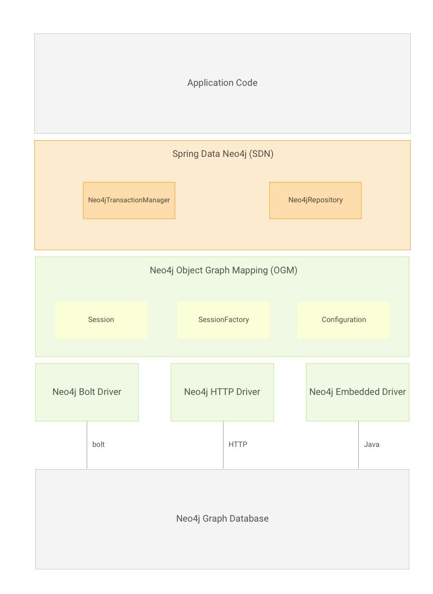

# SpringBoot整合Spring Data Neo4j



这个是Spring Data Neo4j的架构图

* **Driver**用于连接数据库，在这里提供三种Driver：HTTP、Embedded和二进制Bolt，后者使用官方的Neo4j Java驱动程序。
* **Neo4j Object Graph Mapper** (Neo4j-OGM)
* **Spring Data Neo4j**在Neo4-OGM之上提供代码以帮助快速构建基于Spring的Neo4j应用程序。


首先需要导入Spring Data Neo4j的依赖：

```xml
<dependency>
    <groupId>org.springframework.data</groupId>
    <artifactId>spring-data-neo4j</artifactId>
    <version>5.3.3.RELEASE</version>
</dependency>
```


## 配置

有多种方法可以配置：


### application.yml

```yaml
spring:
  output:
    ansi:
      enabled: ALWAYS
  data:
    neo4j:
      username: neo4j					# 用户名
      password: 123456					# 密码
      uri: bolt://10.10.10.246:7687		# 服务器URL
```


### 配置类

```java
package com.example.config;

import org.neo4j.ogm.session.SessionFactory;
import org.springframework.boot.autoconfigure.domain.EntityScan;
import org.springframework.context.annotation.Bean;
import org.springframework.context.annotation.Configuration;
import org.springframework.data.neo4j.repository.config.EnableNeo4jRepositories;

@Configuration
@EnableNeo4jRepositories("com.example.repository")	// repository的包路径
@EntityScan(basePackages = "com.example.entity")	// 实体类的包路径
public class MyNeo4jConfig {

    @Bean
    org.neo4j.ogm.config.Configuration configuration() {
        org.neo4j.ogm.config.Configuration configuration = new org.neo4j.ogm.config.Configuration.Builder()
                .uri("bolt://10.10.10.246:7687")	// 设置服务器URL
                .credentials("neo4j", "123456")		// 设置用户名密码
                .build();
        return configuration;
    }

    @Bean
    public SessionFactory sessionFactory() {
        return new SessionFactory(configuration(), "com.example.entity");
    }

}

```


> Spring Data Neo4j提供了三种Driver
>
> * HTTP Driver
> * Embedded Driver
> * Bolt Driver
>
> 上面两个例子都是使用Bolt Driver，在Neo4j的默认设置下Bolt的端口是7687


## 注解

* **`@NodeEntity`**：声明一个节点实体类
  * `label`：节点的标签
* **`@Id`**：节点的 `identity` 属性
* **`@GeneratedValue`**：`identity` 属性自动增长
* **`@Relationship`**：表示关系字段，一般是 `java.util.Set` 或者 `java.util.List` 的子类
  * `type`：关系的类型，也就是标签
  * `direction`：表明这些关系的方向（入度/出度），可以写的值如下 `Relationship.INCOMING`（入度）、`Relationship.OUTGOING`（出度）和 `Relationship.UNDIRECTED`（未知），默认值是出度
* **`@Properties`**：表示一个节点的properties，一般不怎么用
  * `prefix`：设置属性的前缀
* **`@Query`**：自定义查询语句
* **`@RelationshipEntity`**：定义关系实体类
  * `type`：关系的类型
* **`@StartNode`**：关系实体中出度的节点
* **`@EndNode`**：关系实体中入度的节点


##  OGM (Object Graph Mapper) 

OGM类似于ORM，也就是把节点和关系的实体类映射到neo4j中的节点和关系。


### 编写实体类：

**com.example.entity.Actor**

```java
package com.example.entity;

import lombok.Data;
import org.neo4j.ogm.annotation.*;

import java.util.ArrayList;
import java.util.List;
import java.util.Objects;

@NodeEntity(label = "Actor")
@Data
public class Actor {

    @Id
    @GeneratedValue
    private Long id;
    @Properties
    private String name;

    @Relationship(type = "ACTION_IN")
    private List<Role> roles = new ArrayList<>();

    public Actor(String name) {
        this.name = name;
    }

    public void actionIn(Movie movie, String roleName) {
        Role role = new Role(this, roleName, movie);
        roles.add(role);
        movie.getRoles().add(role);
    }

    @Override
    public boolean equals(Object o) {
        if (this == o) {
            return true;
        }
        if (o == null || getClass() != o.getClass()) {
            return false;
        }
        Actor actor = (Actor) o;
        return Objects.equals(id, actor.id) &&
                Objects.equals(name, actor.name);
    }

    @Override
    public int hashCode() {
        return Objects.hash(id, name);
    }

    @Override
    public String toString() {
        return "Actor{" +
                "id=" + id +
                ", name='" + name + '\'' +
                '}';
    }
}

```


**com.example.entity.Movie**

```java
package com.example.entity;

import lombok.Data;
import org.neo4j.ogm.annotation.GeneratedValue;
import org.neo4j.ogm.annotation.Id;
import org.neo4j.ogm.annotation.NodeEntity;
import org.neo4j.ogm.annotation.Relationship;

import java.util.ArrayList;
import java.util.List;
import java.util.Objects;

@NodeEntity(label = "Movie")
@Data
public class Movie {

    @Id
    @GeneratedValue
    private Long id;

    private String title;

    @Relationship(type = "ACTION_IN", direction = Relationship.INCOMING)
    private List<Role> roles = new ArrayList<>();

    public Movie(String title) {
        this.title = title;
    }

    @Override
    public boolean equals(Object o) {
        if (this == o) {
            return true;
        }
        if (o == null || getClass() != o.getClass()) {
            return false;
        }
        Movie movie = (Movie) o;
        return Objects.equals(id, movie.id) &&
                Objects.equals(title, movie.title);
    }

    @Override
    public int hashCode() {
        return Objects.hash(id, title);
    }

    @Override
    public String toString() {
        return "Movie{" +
                "id=" + id +
                ", title='" + title + '\'' +
                '}';
    }
}

```


**com.example.entity.Role**

```java
package com.example.entity;

import lombok.Data;
import org.neo4j.ogm.annotation.*;

import java.util.Objects;

@RelationshipEntity(type = "ACTION_IN")
@Data
public class Role {

    @Id
    @GeneratedValue
    private Long id;

    @StartNode
    private Actor actor;

    private String role;

    @EndNode
    private Movie movie;

    public Role(Actor actor, String role, Movie movie) {
        this.actor = actor;
        this.role = role;
        this.movie = movie;
    }

    @Override
    public boolean equals(Object o) {
        if (this == o) {
            return true;
        }
        if (o == null || getClass() != o.getClass()) {
            return false;
        }
        Role role1 = (Role) o;
        return Objects.equals(id, role1.id) &&
                Objects.equals(actor, role1.actor) &&
                Objects.equals(role, role1.role) &&
                Objects.equals(movie, role1.movie);
    }

    @Override
    public int hashCode() {
        return Objects.hash(id, actor, role, movie);
    }

    @Override
    public String toString() {
        return "Role{" +
                "id=" + id +
                ", actor=" + actor +
                ", role='" + role + '\'' +
                ", movie=" + movie +
                '}';
    }
}

```


### 编写Repository：

Spring Data Neo4j继承的是 `Neo4jRepository` 接口，他的第一个泛型参数是对应实体类的类型，第二个泛型参数是实体类的ID类型。

他的继承关系是：

```
Repository
	^
	|
CrudRepository
	^
	|
PagingAndSortingRepository
	^
	|
Neo4jRepository
```


**com.example.repository.ActorRepository**

```java
package com.example.repository;

import com.example.entity.Actor;
import org.springframework.data.neo4j.repository.Neo4jRepository;
import org.springframework.stereotype.Repository;

import java.util.List;

@Repository
public interface ActorRepository extends Neo4jRepository<Actor, Long> {
    // MATCH (actor:Actor)-[:ACTION_IN]->(movie:Movie)
    // WHERE movie.title = $title
    // RETURN actor
    List<Actor> findAllByRolesMovieTitle(String title);
    List<Actor> findByName(String name);
}

```


**com.example.repository.MovieRepository**

```java
package com.example.repository;

import com.example.entity.Movie;
import org.springframework.data.neo4j.repository.Neo4jRepository;
import org.springframework.stereotype.Repository;

import java.util.List;

@Repository
public interface MovieRepository extends Neo4jRepository<Movie, Long> {
    // MATCH (actor:Actor)-[:ACTION_IN]->(movie:Movie)
    // WHERE actor.name = $name
    // RETURN movie
    List<Movie> findAllByRolesActorName(String name);
    List<Movie> findByTitle(String title);
}

```

因为在实体类中使用 `@Relationship` 注解定义了一个集合用来存储边，所以在使用方法名字定义查询条件的时候可以使用像 `findAllByRolesActorName` 和 `findAllByRolesMovieTitle` 这种根据其他类型的实体类查询本实体类的方法，命名规则如下：`findAllBy<关系List或Set><关系实体类中Stard node或End node><另外一个实体类的字段及条件>`


和JPA一样只需要在Repository中按照规则完成方法声明就可以生成对应的查询，返回值可以是单个实体类、`List` 接口、`Set` 接口、`Optional`、`Page` 和 `Iterable`：

| Keyword                   | Sample                                                       | Cypher snippet                                               |
| :------------------------ | :----------------------------------------------------------- | :----------------------------------------------------------- |
| `After`                   | `findByLaunchDateAfter(Date date)`                           | `n.launchDate > date`                                        |
| `Before`                  | `findByLaunchDateBefore(Date date)`                          | `n.launchDate < date`                                        |
| `Containing` (String)     | `findByNameContaining(String namePart)`                      | `n.name CONTAINS namePart`                                   |
| `Containing` (Collection) | `findByEmailAddressesContains(Collection addresses)``findByEmailAddressesContains(String address)` | `ANY(collectionFields IN [addresses] WHERE collectionFields in n.emailAddresses)``ANY(collectionFields IN address WHERE collectionFields in n.emailAddresses)` |
| `In`                      | `findByNameIn(Iterable names)`                               | `n.name IN names`                                            |
| `Between`                 | `findByScoreBetween(double min, double max)` `findByScoreBetween(Range range)` | `n.score >= min AND n.score <= max` Depending on the `Range` definition `n.score >= min AND n.score <= max` or `n.score > min AND n.score < max` |
| `StartingWith`            | `findByNameStartingWith(String nameStart)`                   | `n.name STARTS WITH nameStart`                               |
| `EndingWith`              | `findByNameEndingWith(String nameEnd)`                       | `n.name ENDS WITH nameEnd`                                   |
| `Exists`                  | `findByNameExists()`                                         | `EXISTS(n.name)`                                             |
| `True`                    | `findByActivatedIsTrue()`                                    | `n.activated = true`                                         |
| `False`                   | `findByActivatedIsFalse()`                                   | `NOT(n.activated = true)`                                    |
| `Is`                      | `findByNameIs(String name)`                                  | `n.name = name`                                              |
| `NotNull`                 | `findByNameNotNull()`                                        | `NOT(n.name IS NULL)`                                        |
| `Null`                    | `findByNameNull()`                                           | `n.name IS NULL`                                             |
| `GreaterThan`             | `findByScoreGreaterThan(double score)`                       | `n.score > score`                                            |
| `GreaterThanEqual`        | `findByScoreGreaterThanEqual(double score)`                  | `n.score >= score`                                           |
| `LessThan`                | `findByScoreLessThan(double score)`                          | `n.score < score`                                            |
| `LessThanEqual`           | `findByScoreLessThanEqual(double score)`                     | `n.score <= score`                                           |
| `Like`                    | `findByNameLike(String name)`                                | `n.name =~ name`                                             |
| `NotLike`                 | `findByNameNotLike(String name)`                             | `NOT(n.name =~ name)`                                        |
| `Near`                    | `findByLocationNear(Distance distance, Point point)`         | `distance( point(n),point({latitude:lat, longitude:lon}) ) < distance` |
| `Regex`                   | `findByNameRegex(String regex)`                              | `n.name =~ regex`                                            |
| `And`                     | `findByNameAndDescription(String name, String description)`  | `n.name = name AND n.description = description`              |
| `Or`                      | `findByNameOrDescription(String name, String description)`   | `n.name = name OR n.description = description` (Cannot be used to OR nested properties) |

> 如果需要使用neo4j的排序和分页共功能只需要在方法最后加上 `Sort` 和 `Pageable` 的参数即可
>
> 
>
> 如果不想遵守命名规则或者要自定义查询语句使用 `@Query` 注解实现：
>
> ```java
> @Query("MATCH (:Actor {name:$name})-[:ACTED_IN]->(m:Movie) return m")
> ```
>
> `$` 开头的表示引用方法参数，可以使 `$参数名` 或者 `$位置参数`，前者使用对应的参数名，后者使用对应位置的参数（位置从0开始）

测试：

```java
@Autowired
private ActorRepository actorRepository;

@Autowired
private MovieRepository movieRepository;

@Test
void testConnect() {
    Assert.notNull(actorRepository, "ActorRepository is null");
    Assert.notNull(movieRepository, "MovieRepository is null");
}

@Test
void testSave() {
    Actor actor = new Actor("aa");
    Actor actor1 = new Actor("bb");
    actorRepository.save(actor);
    actorRepository.save(actor1);
}

@Test
void testSave2() {
    Movie movie = new Movie("aa-movie");
    Movie movie1 = new Movie("bb-movie");
    movieRepository.save(movie);
    movieRepository.save(movie1);
}

@Test
void addRelationship() {
    Actor actor0 = actorRepository.findById(0L).get();
    Actor actor1 = actorRepository.findById(1L).get();
    Movie movie2 = movieRepository.findById(2L).get();
    Movie movie3 = movieRepository.findById(3L).get();

    actor0.actionIn(movie2, "导演");
    actor0.actionIn(movie3, "编剧");
    actor1.actionIn(movie3, "导演");
    actor1.actionIn(movie2, "编剧");

    actorRepository.save(actor0);
    actorRepository.save(actor1);
    movieRepository.save(movie2);
    movieRepository.save(movie3);
}

@Test
void testFindNodeByRelation() {
    List<Actor> all = actorRepository.findAllByRolesMovieTitle("aa-movie");
    all.forEach(actor -> {
        System.out.println(actor.getId() + " : " + actor.getName());
    });

    System.out.println("--------------------------------------");
    List<Movie> all2 = movieRepository.findAllByRolesActorName("update_bb");
    all2.forEach(movie -> {
        System.out.println(movie.getId() + " : " + movie.getTitle());
    });
}

@Test
void testUpdateNode() {
    Actor aa = actorRepository.findByName("aa").get(0);
    Actor bb = actorRepository.findByName("bb").get(0);
    aa.setName("update_aa");
    bb.setName("update_bb");

    actorRepository.save(aa);
    actorRepository.save(bb);
}

@Test
void testPrintRelation() {
    Actor aa = actorRepository.findByName("update_aa").get(0);
    aa.getRoles().forEach(role -> {
        System.out.println(role.getActor() + " -> " + role.getMovie());
    });

    System.out.println("---------------------------------");

    Movie movie = movieRepository.findByTitle("bb-movie").get(0);
    movie.getRoles().forEach(role -> {
        System.out.println(role.getActor() + " -> " + role.getMovie());
    });
}

@Test
void testFindAll() {
    Iterable<Actor> all = actorRepository.findAll();

    Iterator<Actor> iterator = all.iterator();

    while (iterator.hasNext()) {
        System.out.println(iterator.next());
    }
}
```


### Cypher examples

- `MATCH (n) WHERE id(n)=9 RETURN n`

  returns the node with id 9

- `MATCH (movie:Movie {title:'Matrix'}) RETURN movie`

  returns the nodes which are indexed with title equal to 'Matrix'

- `MATCH (movie:Movie {title:'Matrix'})←[:ACTS_IN]-(actor) RETURN actor.name`

  returns the names of the actors that have a ACTS_IN relationship to the movie node for 'Matrix'

- `MATCH (movie:Movie {title:'Matrix'})←[r:RATED]-(user) WHERE r.stars > 3 RETURN user.name, r.stars, r.comment`

  returns users names and their ratings (>3) of the movie titled 'Matrix'

- `MATCH (user:User {name='Michael'})-[:FRIEND]-(friend)-[r:RATED]->(movie) RETURN movie.title, AVG(r.stars), COUNT(*) ORDER BY AVG(r.stars) DESC, COUNT(*) DESC`

  returns the movies rated by the friends of the user 'Michael', aggregated by `movie.title`, with averaged ratings and rating-counts sorted by both


### 使用方法名和`@Query`注解对比

以下是使用 `@Query` 注解实现的功能：

```java
public interface MovieRepository extends Neo4jRepository<Movie, Long> {

    // returns the node with id equal to idOfMovie parameter
    @Query("MATCH (n) WHERE id(n)=$0 RETURN n")
    Movie getMovieFromId(Integer idOfMovie);

    // returns the nodes which have a title according to the movieTitle parameter
    @Query("MATCH (movie:Movie {title=$0}) RETURN movie")
    Movie getMovieFromTitle(String movieTitle);

    // same with optional result
    @Query("MATCH (movie:Movie {title=$0}) RETURN movie")
    Optional<Movie> getMovieFromTitle(String movieTitle);

    // returns a Page of Actors that have a ACTS_IN relationship to the movie node with the title equal to movieTitle parameter.
    @Query(value = "MATCH (movie:Movie {title=$0})<-[:ACTS_IN]-(actor) RETURN actor", countQuery= "MATCH (movie:Movie {title=$0})<-[:ACTS_IN]-(actor) RETURN count(actor)")
    Page<Actor> getActorsThatActInMovieFromTitle(String movieTitle, PageRequest page);

    // returns a Page of Actors that have a ACTS_IN relationship to the movie node with the title equal to movieTitle parameter with an accurate total count
    @Query(value = "MATCH (movie:Movie {title=$0})<-[:ACTS_IN]-(actor) RETURN actor", countQuery = "MATCH (movie:Movie {title=$0})<-[:ACTS_IN]-(actor) RETURN count(*)")
    Page<Actor> getActorsThatActInMovieFromTitle(String movieTitle, Pageable page);

    // returns a Slice of Actors that have a ACTS_IN relationship to the movie node with the title equal to movieTitle parameter.
    @Query("MATCH (movie:Movie {title=$0})<-[:ACTS_IN]-(actor) RETURN actor")
    Slice<Actor> getActorsThatActInMovieFromTitle(String movieTitle, Pageable page);

    // returns users who rated a movie (movie parameter) higher than rating (rating parameter)
    @Query("MATCH (movie:Movie)<-[r:RATED]-(user) " +
           "WHERE id(movie)=$movieId AND r.stars > {rating} " +
           "RETURN user")
    Iterable<User> getUsersWhoRatedMovieFromTitle(@Param("movieId") Movie movie, @Param("rating") Integer rating);

    // returns users who rated a movie based on movie title (movieTitle parameter) higher than rating (rating parameter)
    @Query("MATCH (movie:Movie {title:$0})<-[r:RATED]-(user) " +
           "WHERE r.stars > $1 " +
           "RETURN user")
    Iterable<User> getUsersWhoRatedMovieFromTitle(String movieTitle, Integer rating);

    @Query(value = "MATCH (movie:Movie) RETURN movie;")
    Stream<Movie> getAllMovies();
```


以下是使用方法名实现的功能：

```java
public interface PersonRepository extends Neo4jRepository<Person, Long> {

    // MATCH (person:Person {name=$0}) RETURN person
    Person findByName(String name);

    // MATCH (person:Person)
    // WHERE person.age = $0 AND person.married = $1
    // RETURN person
    Iterable<Person> findByAgeAndMarried(int age, boolean married);

    // MATCH (person:Person)
    // WHERE person.age = $0
    // RETURN person ORDER BY person.name SKIP $skip LIMIT $limit
    Page<Person> findByAge(int age, Pageable pageable);

    // MATCH (person:Person)
    // WHERE person.age = $0
    // RETURN person ORDER BY person.name
    List<Person> findByAge(int age, Sort sort);

    // Allow a custom depth as a parameter
    Person findByName(String name, @Depth int depth);

    // Set a fix depth of 0 for the query
    @Depth(value = 0)
    Person findBySurname(String surname);

}
```


### `@Query` 和 `@QueryResult`

使用 `@Query` 注解查询后返回可以不是对应的实体类，可以自定义一个返回结果集，需要使用 `@QueryResult` 注解声明。

但是要保证 `@QueryResult` 的字段和返回的字段名字完全相同，最好在CQL中使用 `AS` 关键字定义：

```java
public interface MovieRepository extends Neo4jRepository<Movie, Long> {

    @Query("MATCH (movie:Movie)-[r:RATING]->(), (movie)<-[:ACTS_IN]-(actor:Actor) " +
           "WHERE movie.id=$0 " +
           "RETURN movie as movie, COLLECT(actor) AS cast, AVG(r.stars) AS averageRating")
    MovieData getMovieData(String movieId);
}


@QueryResult
public class MovieData {
    Movie movie;
    Double averageRating;
    Set<Actor> cast;
}
```


## 事务

Neo4j支持事务，使用方法和JPA的一样，在配置类上开始事务 `@EnableTransactionManagement` ，然后在 `@Service` 类的方法上使用 `@Transactional ` 开始事务


## 注意点

如果在实体类中引入了关系，也就是由 `Collection` 和 `@RelationShip` 声明了关系，那么**自己重写`toString()`、`equals()` 和 `hashCode()`** 方法

而且重写的时候**不能把 `@RelationShip` 注解标注的 `Collection` 写入到这三个方法中，否则在使用的时候会抛出`StackOverFlow` 异常**

原因是如果使用 `Set` 接口存储节点关系，那么每次add的时候都会调用hashCode方法，如果使用Lombok自动生成就会把所有属性一起计算hash，也就意味着把 `Set` 也参与计算，`Set` 中存储的是关系实体，包含出度入读节点，而 `Set` 又会把所有元素都进行hashCode计算，也就是把出毒入度节点再hashCode计算，如此循环下去就会`StackOverFlow`

`toString()` 也类似，实体类调用 `toString()` ，当toString中遇到 `Set` 又调用 `Set` 的 `toString()` ，而 `Set` 又调用所有元素包括出度入读节点 `toString()` ，结果有回到刚开始，直到 `StackOverFlow` 

 