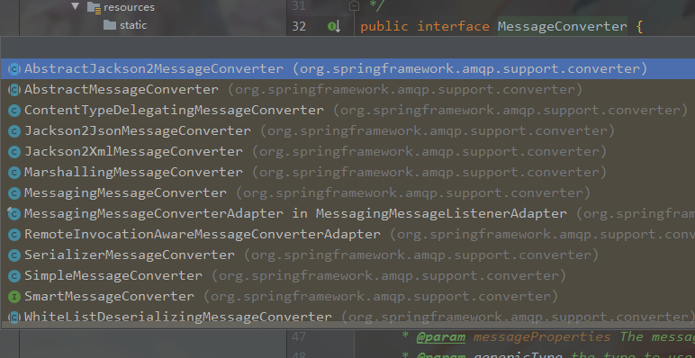

# SpringBoot集成RabbitMQ

### 安装使用RabbitMQ

#### 首先使用docker搭建RabbitMQ环境

```shell
$ docker pull rabbitmq:3-management
$ docker run -d --hostname my-rabbit --name some-rabbit -p 15672:15672 -p 5672:5672 rabbitmq:3-management
```

注意镜像的tag是带了management，这个和不带management版本的区别就是management自带了管理插件，管理界面端口是15672，默认用户名密码是`guest/guest`


#### 创建交换机


交换机类型：

* direct：顶对点类型，根据发送消息由键匹配对应的队列
* fanout：广播类型，广播到所有绑定的队列
* topic：主题类型，根据发送的消息的路由键模糊匹配对应的队列，通过`*`和`#`进行模糊匹配


#### 创建队列


#### 绑定队列和交换机


fanout类型绑定的队列写不写routing key都无所谓i，因为他会接收到的消息都路由到绑定的所有队列上

topic类型绑定


`#`和`*`的区别：

`#`会匹配一个或者多个单词，`*`代表匹配一个单词


#### 测试发送消息


队列接收到消息


### SpringBoot整合RabbitMQ

#### SpringBoot添加AMQP依赖

```xml
<dependency>
    <groupId>org.springframework.boot</groupId>
    <artifactId>spring-boot-starter-amqp</artifactId>
</dependency>
```


#### 添加rabbit的配置

```yaml
spring:
  rabbitmq:
    port: 5672				# rabbit的端口
    host: 10.10.10.246		# rabbit的地址
    username: guest
    password: guest
    virtual-host: /			# 连接的虚拟主机名
```


#### RabbitTemplate发送接收消息

```java
@SpringBootTest
class LearndemoApplicationTests {

	@Autowired
	private RabbitTemplate rabbitTemplate;

	@Test
	void testSend() {
		rabbitTemplate.convertAndSend("exchange.fanout", "", "hello message");
		rabbitTemplate.convertAndSend("exchange.direct", "goverment.news", "gorverment news");
		rabbitTemplate.convertAndSend("exchange.topic", "company.emps", "new emp");
	}

	@Test
	void testReceive() {
		String msg = (String) rabbitTemplate.receiveAndConvert("company.emps");
		System.out.println(msg);
	}

}
```

`convertAndSend`会自动序列化消息并发送，该方法有很多重载方法，这里使用的方法的第一个参数是交换机名字，第二个参数是路由键，第三个参数是消息

`receiveAndConvert`会接收消息并转化消息体，参数是需要监听的消息队列

发送和接收默认使用JDK的序列化规则，如果之前在web界面发送的消息用`receiveAndConvert`接收会反序列化失败并抛出`java.lang.ClassCastException`异常

要修改消息转化策略只需要调用`RabbitTemplate`的`setMessageConverter`方法设置消息转换器即可，只要实现了`MessageConverter`接口就行




设置JSON格式化消息

```java
rabbitTemplate.setMessageConverter(new Jackson2JsonMessageConverter());
```


#### 消费消息

在配置类上加上`@EnableRabbit`注解开启Rabbit

```java
@SpringBootApplication
@EnableRabbit
public class LearndemoApplication {
	public static void main(String[] args) {
		SpringApplication.run(LearndemoApplication.class, args);
	}
}
```

监听topic队列

```java
@Component
public class CompanyConsumer {

    @RabbitListener(bindings = @QueueBinding(
            value = @Queue(value = "company"),
            exchange = @Exchange(value = "exchange.topic", type = ExchangeTypes.TOPIC),
            key = "company.*"
    ))
    public void companyMessage(String msg) {
        System.out.println("company topic msg: " + msg);
    }

}
```

首先要把类添加到spring组件里面，在方法上添加`@RabbitListener`添加注解绑定队列，除了上面这种方法也可以只指定队列绑定，方法参数是接收的消息


监听direct队列

```java
@Component
@RabbitListener(bindings = @QueueBinding(
        value = @Queue(value = "goverment.news"),
        exchange = @Exchange(value = "exchange.direct", type = ExchangeTypes.DIRECT),
        key = "goverment.news"
))
public class GovermentNewsConsumer {

    @RabbitHandler
    public void handler(String msg) {
        System.out.println("goverment news: " + msg);
    }

}
```

如果`@RabbitListener`加载在类上那么要在处理消息的方法上添加`@RabbitHandler`注解，方法参数是接收的消息


监听fanout队列

```java
@Component
@RabbitListener(bindings = @QueueBinding(
        value = @Queue(value = "company.news"),
        exchange = @Exchange(value = "exchange.fanout", type = ExchangeTypes.FANOUT)
))
public class CompanyNewsConsumer {

    @RabbitHandler
    public void handle(String msg) {
        System.out.println("fanout message: " + msg);
    }

}
```

fanout类型的交换机绑定可以不指定路由键


> 使用注解方式监听消息队列时，如果rabbit server上没有对应的交换机和队列，那么springboot会在rabbit server自动创建并绑定对应的交换机和队列


### AmqpAdmin管理RabbitMQ

注入`AmqpAdmin`

```java
@Autowired
private AmqpAdmin amqpAdmin;
```

添加和删除交换机

```java
// 定义一个direct类型的交换机，名字为test1，设置持久化，不自动删除
amqpAdmin.declareExchange(new DirectExchange("test1", true, false));
// 删除叫test1的交换机
amqpAdmin.deleteExchange("test1");
```

添加删除队列

```java
// 定义一个叫queue1的队列，并持久化
amqpAdmin.declareQueue(new Queue("queue1", true));
// 删除叫queue1的队列
amqpAdmin.deleteQueue("queue1");
```

绑定交换机和队列	

```java
amqpAdmin.declareExchange(new TopicExchange("exchange1", true, false));
amqpAdmin.declareQueue(new Queue("queue1", true));
// 绑定exchange1和queue1，设置路由键为*.key.#
amqpAdmin.declareBinding(new Binding("queue1",
                                     Binding.DestinationType.QUEUE,
                                     "exchange1",
                                     "*.key.#",
                                     null));
```

