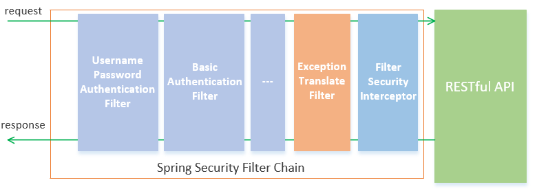

### SpringBoot集成Spring Security

首先导入Spring Security的依赖

```xml
<dependency>
    <groupId>org.springframework.boot</groupId>
    <artifactId>spring-boot-starter-security</artifactId>
</dependency>
```


然后定义配置类开启Spring Security并继承`WebSecurityConfigurerAdapter`配置

```java
@Configuration
@EnableWebSecurity
public class SecurityConfiguration extends WebSecurityConfigurerAdapter {

    @Override
    protected void configure(HttpSecurity http) throws Exception {
        http.authorizeRequests()        // 对请求进行认证
                .anyRequest().authenticated()       // 所有请求都要认证
                .and()
                .formLogin();         // 使用表单验证
    }
}
```

控制台会输出认证key，默认用户名是user

```
Using generated security password: b054b2e4-5360-4f8a-b254-2610e6b2c79d
```


SpringSecurity的原理是使用过滤器完成验证的，过滤器链大致如下




### 自定义用户认证

首先实现`UserDetailsService`接口重写`loadUserByUsername`的用户认证逻辑

这个方法返回`UserDetails`接口，这里返回`org.springframework.security.core.userdetails.User`，是他的一个实现类，注意不要导错包

```java
@Configuration
public class LevelUserDetailsService implements UserDetailsService {

    @Autowired
    private LevelUserService levelUserService;

    @Override
    public UserDetails loadUserByUsername(String username) throws UsernameNotFoundException {
        LevelUser levelUser = levelUserService.getLevelUserByName(username);
        if (levelUser == null) {
            return null;
        }

        return new User(username,       // 用户名
                levelUser.getPassword(),    // 密码
                true,               // 该用户是否开启
                true,       // 用户没有过期
                true,   // 用户证书没有过期
                true,       // 用户没有被锁定
                AuthorityUtils.commaSeparatedStringToAuthorityList(levelUser.getRole()));   // 用户有哪些权限
    }
}

```

`AuthorityUtils.commaSeparatedStringToAuthorityList(String)`用来将字符串转化为权限


然乎自定义密码规则，使用SpringSecurity推荐的

```java
@Bean
public PasswordEncoder passwordEncoderBean() {
    return new BCryptPasswordEncoder();
}
```

自定义html等路页面，登陆的用户名密码表单的name属性要和`UsernamePasswordAuthenticationFilter`定义的一样

```java
public class UsernamePasswordAuthenticationFilter extends
		AbstractAuthenticationProcessingFilter {
	// ~ Static fields/initializers
	// =====================================================================================

	public static final String SPRING_SECURITY_FORM_USERNAME_KEY = "username";
	public static final String SPRING_SECURITY_FORM_PASSWORD_KEY = "password";

	private String usernameParameter = SPRING_SECURITY_FORM_USERNAME_KEY;
	private String passwordParameter = SPRING_SECURITY_FORM_PASSWORD_KEY;
	private boolean postOnly = true;

	// ~ Constructors
	// ===================================================================================================
...
```

添加配置

```java
@Component
public class MyAuthenticationFailureHandler implements AuthenticationFailureHandler {
    @Override
    public void onAuthenticationFailure(HttpServletRequest request, HttpServletResponse response, AuthenticationException exception) throws IOException, ServletException {
        response.setCharacterEncoding("UTF-8");
        PrintWriter writer = response.getWriter();
        writer.println("登陆失败!");
    }
}
```

```java
@Override
protected void configure(HttpSecurity http) throws Exception {
    http.authorizeRequests()        // 对请求进行认证
        .antMatchers("/", "/index", "/index.html", "/form", "/constraint").permitAll()      // 允许放行的URI
        .anyRequest().authenticated()       // 所有请求都要认证
        .and()
        .formLogin()         // 使用表单验证
        .loginPage("/form")         // 定义认证页
        .loginProcessingUrl("/constraint")      // 定义认证逻辑的URI
        .failureHandler(myAuthenticationFailureHandler)
        .successForwardUrl("/index")
        .and()
        .csrf().disable();          // 关闭CSRF否则表单登陆失败
}
```

`.formLogin()`可以设置很多东西，比如：

* `.successHandler()`成功的处理器， 传入`AuthenticationSuccessHandler`的实现
* `.successForwardUrl()`成功后重定向的URL
* `.failureHandler()`失败的处理器，传入`AuthenticationFailureHandler`的实现
* `.failureForwardUrl()`登陆失败后的URL


成功登陆后在其他地方（controller， service）注入`Authentication `会有这些信息

```json
{
  "authorities": [
    {
      "authority": "admin"
    }
  ],
  "details": {
    "remoteAddress": "0:0:0:0:0:0:0:1",
    "sessionId": "8D50BAF811891F4397E21B4B537F0544"
  },
  "authenticated": true,
  "principal": {
    "password": null,
    "username": "mrbird",
    "authorities": [
      {
        "authority": "admin"
      }
    ],
    "accountNonExpired": true,
    "accountNonLocked": true,
    "credentialsNonExpired": true,
    "enabled": true
  },
  "credentials": null,
  "name": "mrbird"
}
```


如果`WebSecurityConfigurerAdapter`使用这个方法

```java
@Override
protected void configure(AuthenticationManagerBuilder auth) throws Exception {
    auth.inMemoryAuthentication().withUser("aa").password("123456").authorities("level1");
}
```

在内存或者数据库读取用户


### 退出设置

```java
http.logout()           // 定义注销
    .logoutUrl("/logout")       // 注销的URL
    .logoutSuccessUrl("/index")     // 注销成功后跳转到的地址
    .deleteCookies("JSRSESSION");       // 注销删除COOKIE
	.clearAuthentication(true);
//  .logoutSuccessUrl(LogoutSuccessHandler)   // 退出成功后的handler
```


### Session管理

 Session超时时间也就是用户登录的有效时间。要设置Session超时时间很简单，只需要在配置文件中添加：

```yaml
server:
  session:
    timeout: 3600
```


```java
http.sessionManagement()        // 开启session管理
    .maximumSessions(5)     // 一个用户最多持有的session数量
    .expiredUrl("/form")    // session失效后跳转地址
    .maxSessionsPreventsLogin(true);    // 如果session达到maximumSessions就不允许登陆
//	..expiredSessionStrategy()  session过期后的Strategy，传入SessionInformationExpiredStrategy的实现类
```


##### 使用Spring Session和Redis管理Session

导入依赖

```xml
<dependency>
    <groupId>org.springframework.session</groupId>
    <artifactId>spring-session-data-redis</artifactId>
</dependency>
<dependency>
    <groupId>org.springframework.boot</groupId>
    <artifactId>spring-boot-starter-data-redis</artifactId>
</dependency>
```

配置redis地址和session存储方式

```yaml
spring:
  thymeleaf:
    cache: false
  session:
    store-type: REDIS
  redis:
    host: 10.10.10.246
    port: 6379
    database: 1
    jedis:
      pool:
        max-idle: 8
        min-idle: 0
        max-active: 8
        max-wait: 1
    timeout: 3000
```

之后web项目的session就都会存在redis里面了


其他操作

` *SessionRegistry* ` 包含了一些使用的操作Session的方法，比如： 

 踢出用户（让Session失效） 

```java
String currentSessionId = request.getRequestedSessionId();
sessionRegistry.getSessionInformation(sessionId).expireNow();
```

 获取所有Session信息： 

```java
List<Object> principals = sessionRegistry.getAllPrincipals();
```


### 记住我功能

导入依赖

```xml
<dependency>
    <groupId>mysql</groupId>
    <artifactId>mysql-connector-java</artifactId>
    <version>8.0.19</version>
</dependency>
<dependency>
    <groupId>org.springframework.boot</groupId>
    <artifactId>spring-boot-starter-jdbc</artifactId>
</dependency>
```

找到`JdbcDaoSupport`按住Ctrl + Alt + B查看实现类，找到`JdbcTokenRepositoryImpl`

不配置就会保存在内存中

```java
public class JdbcTokenRepositoryImpl extends JdbcDaoSupport implements
		PersistentTokenRepository {
	// ~ Static fields/initializers
	// =====================================================================================

	/** Default SQL for creating the database table to store the tokens */
	public static final String CREATE_TABLE_SQL = "create table persistent_logins (username varchar(64) not null, series varchar(64) primary key, "
			+ "token varchar(64) not null, last_used timestamp not null)";
	/** The default SQL used by the <tt>getTokenBySeries</tt> query */
	public static final String DEF_TOKEN_BY_SERIES_SQL = "select username,series,token,last_used from persistent_logins where series = ?";
	/** The default SQL used by <tt>createNewToken</tt> */
	public static final String DEF_INSERT_TOKEN_SQL = "insert into persistent_logins (username, series, token, last_used) values(?,?,?,?)";
	/** The default SQL used by <tt>updateToken</tt> */
	public static final String DEF_UPDATE_TOKEN_SQL = "update persistent_logins set token = ?, last_used = ? where series = ?";
	/** The default SQL used by <tt>removeUserTokens</tt> */
	public static final String DEF_REMOVE_USER_TOKENS_SQL = "delete from persistent_logins where username = ?";

	// ~ Instance fields
	// 
```

复制建表语句去数据库执行

```sql
create table persistent_logins 
(
username varchar(64) not null, 
series varchar(64) primary key, 
token varchar(64) not null, 
last_used timestamp not null
);
```

配置`JdbcTokenRepositoryImpl`

```java
@Autowired
private DataSource dataSource;

@Bean
public PersistentTokenRepository persistentTokenRepositoryBean() {
    JdbcTokenRepositoryImpl jdbcTokenRepository = new JdbcTokenRepositoryImpl();
    jdbcTokenRepository.setDataSource(dataSource);
    jdbcTokenRepository.setCreateTableOnStartup(false);     // 不在执行建表语句
    return jdbcTokenRepository;
}
```

在input表单设置记住我选框的name为`remember-me`或者自己修改name属性配置

配置remember me

```java
http.rememberMe()       // 添加记住我功能
    .tokenRepository(persistentTokenRepositoryBean())    // 配置 token 持久化仓库
    .tokenValiditySeconds(3600)           // remember 过期时间，单为秒
    .userDetailsService(levelUserDetailsService)    // 处理自动登录逻辑
    .rememberMeParameter("remember_me");            // 表单name属性
```


### 权限控制

```
http.authorizeRequests()        // 对请求进行认证
.antMatchers("/level1/*").hasAnyAuthority("level1", "admin")	// 允许一个资源只能有对应劝降的人访问
.antMatchers("/level2/*").hasAnyAuthority("level2", "admin")
.antMatchers("/level3/*").hasAnyAuthority("level3", "admin")
.antMatchers("/", "/index", "/index.html", "/form", "/constraint", "/logout").permitAll()      // 允许放行的URI
.anyRequest().authenticated()       // 所有请求都要认证
.and();
```

* `hasAnyAuthority(String...)`设置权限列表
* `hasAnyRole(String...)`设置一个权限
* ``hasAuthority(String)`设置角色列表
* ``hasRole(String)`设置一个角色
* `hasIpAddress()`只允许放行的ip地址


拦截GET, POST, PUT, DELETE请求

```java
http.authorizeRequests()
    .antMatchers(HttpMethod.GET, "/test1").authenticated()	// 拦截/test1的GET请求
    .antMatchers(HttpMethod.POST, "/test2").authenticated()   // 拦截/test2的POST请求
    .antMatchers(HttpMethod.PUT, "/test3").authenticated()   // 拦截/test3的PUT请求
    .antMatchers(HttpMethod.DELETE, "/test4").authenticated()  // 拦截/test4的DELETE请求
```


> 角色和权限的区别
>
> 1. 权限只是一个字符串，在`UserDetailsService`使用`AuthorityUtils.commaSeparatedStringToAuthorityList(String)`返回，比较的时候会把用户的权限拿出来和配置的比较
> 2. 角色会在比较的时候把``hasAuthority(String)`和``hasRole(String)`设置的字符串前面加上`ROLE_`再比较，所以使用角色要在`UserDetailsService`设置权限时加上`ROLE_`


设置用户Access Denied的处理器

实现`AccessDeniedHandler`接口

然后设置

```java
http.exceptionHandling()
	.accessDeniedHandler(myAccessDeniedHandler);
```

