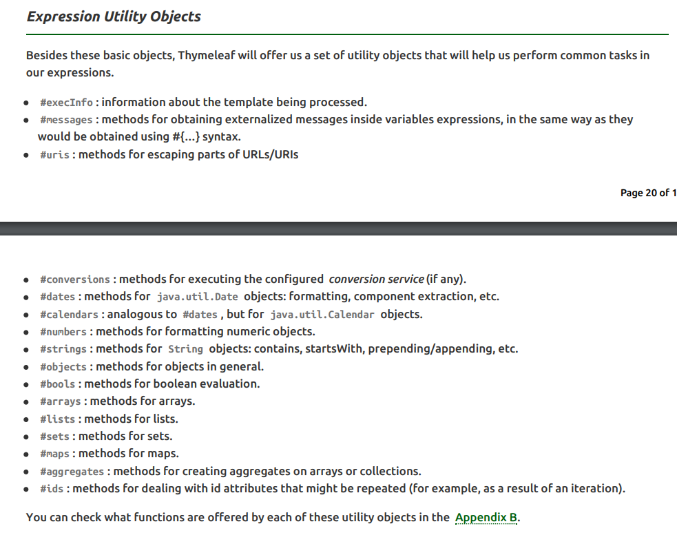
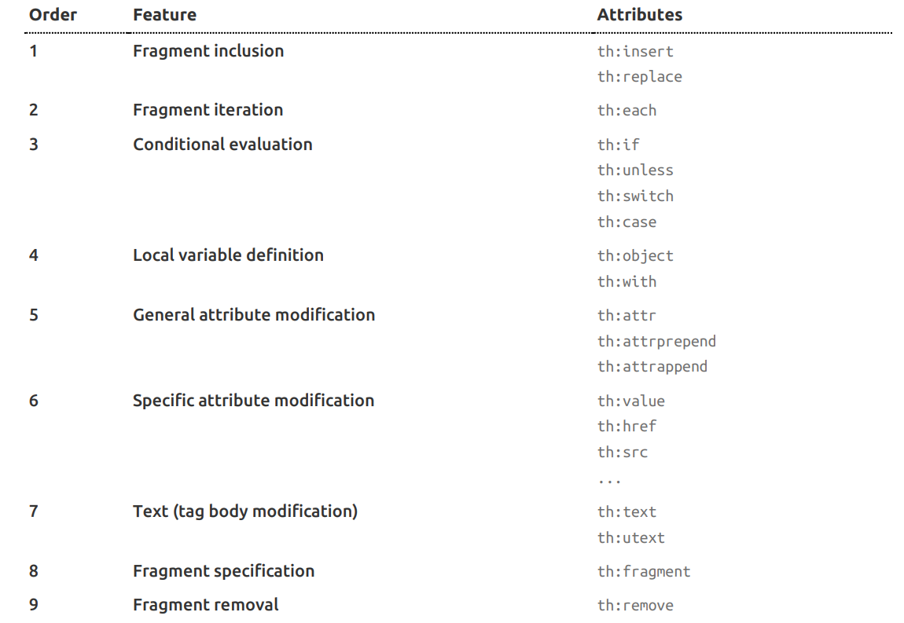

### Thymeleaf自动装配

#### 找到模板存放位置

1. 找到`org.springframework.boot.autoconfigure.thymeleaf.ThymeleafAutoConfiguration`

```java
/**
 * {@link EnableAutoConfiguration Auto-configuration} for Thymeleaf.
 *
 * @author Dave Syer
 * @author Andy Wilkinson
 * @author Stephane Nicoll
 * @author Brian Clozel
 * @author Eddú Meléndez
 * @author Daniel Fernández
 * @author Kazuki Shimizu
 * @author Artsiom Yudovin
 * @since 1.0.0
 */
@Configuration(proxyBeanMethods = false)
@EnableConfigurationProperties(ThymeleafProperties.class)
@ConditionalOnClass({ TemplateMode.class, SpringTemplateEngine.class })
@AutoConfigureAfter({ WebMvcAutoConfiguration.class, WebFluxAutoConfiguration.class })
public class ThymeleafAutoConfiguration {

	@Configuration(proxyBeanMethods = false)
	@ConditionalOnMissingBean(name = "defaultTemplateResolver")
	static class DefaultTemplateResolverConfiguration {

		private static final Log logger = LogFactory.getLog(DefaultTemplateResolverConfiguration.class);

		private final ThymeleafProperties properties;

		private final ApplicationContext applicationContext;

		DefaultTemplateResolverConfiguration(ThymeleafProperties properties, ApplicationContext applicationContext) {
			this.properties = properties;
			this.applicationContext = applicationContext;
		}

		@PostConstruct
		void checkTemplateLocationExists() {
			boolean checkTemplateLocation = this.properties.isCheckTemplateLocation();
		...
```

2. 找到`defaultTemplateResolver`

```java
@Bean
SpringResourceTemplateResolver defaultTemplateResolver() {
    SpringResourceTemplateResolver resolver = new SpringResourceTemplateResolver();
    resolver.setApplicationContext(this.applicationContext);
    resolver.setPrefix(this.properties.getPrefix());
    resolver.setSuffix(this.properties.getSuffix());
    resolver.setTemplateMode(this.properties.getMode());
    if (this.properties.getEncoding() != null) {
        resolver.setCharacterEncoding(this.properties.getEncoding().name());
    }
    resolver.setCacheable(this.properties.isCache());
    Integer order = this.properties.getTemplateResolverOrder();
    if (order != null) {
        resolver.setOrder(order);
    }
    resolver.setCheckExistence(this.properties.isCheckTemplate());
    return resolver;
}

}
```

3. 跳转到`getSuffix`

   ```java
   public String getSuffix() {
       return this.suffix;
   }
   ```

   ```java
   /**
   	 * Suffix that gets appended to view names when building a URL.
   	 */
   private String suffix = DEFAULT_SUFFIX;
   ```

   ```java
   public static final String DEFAULT_SUFFIX = ".html";
   ```

4. 回到第2步，跳转到`getPrefix`

   ```java
   public String getPrefix() {
       return this.prefix;
   }
   ```

   ```java
   /**
   	 * Prefix that gets prepended to view names when building a URL.
   	 */
   private String prefix = DEFAULT_PREFIX;
   ```

   ```java
   public static final String DEFAULT_PREFIX = "classpath:/templates/";
   ```
   
5. `org.springframework.boot.autoconfigure.thymeleaf.ThymeleafProperties`

   ```java
   /**
    * Properties for Thymeleaf.
    *
    * @author Stephane Nicoll
    * @author Brian Clozel
    * @author Daniel Fernández
    * @author Kazuki Shimizu
    * @since 1.2.0
    */
   @ConfigurationProperties(prefix = "spring.thymeleaf")
   public class ThymeleafProperties {
   
   	private static final Charset DEFAULT_ENCODING = StandardCharsets.UTF_8;
   
   	public static final String DEFAULT_PREFIX = "classpath:/templates/";
   
   	public static final String DEFAULT_SUFFIX = ".html";
   
   	/**
   	 * Whether to check that the template exists before rendering it.
   	 */
   	private boolean checkTemplate = true;
   
   	/**
   	...
   ```

   
### Thymeleaf使用

导入依赖

```xml
<dependency>
    <groupId>org.springframework.boot</groupId>
    <artifactId>spring-boot-starter-thymeleaf</artifactId>
</dependency>
```

在html中加上命名空间

```html
<!DOCTYPE html>
<html xmlns:th="http://www.thymeleaf.org">
<head>
<title>Good Thymes Virtual Grocery</title>
<meta http-equiv="Content-Type" content="text/html; charset=UTF-8" />
<link rel="stylesheet" type="text/css" media="all"
href="../../css/gtvg.css" th:href="@{/css/gtvg.css}" />
</head>
<body>
<p th:text="#{home.welcome}">Welcome to our grocery store!</p>
</body>
</html>
```


### Thymeleaf表达式

* Simple expressions:
  * Variable Expressions: ${...}
  * Selection Variable Expressions: *{...}
  * Message Expressions: #{...}
  * Link URL Expressions: @{...}
  * Fragment Expressions: ~{...}
  
* Literals
  * Text literals: 'one text' , 'Another one!' 
  * Number literals: 0 , 34 , 3.0 , 12.3 
  * Boolean literals: true , false
  * Null literal: null
  * Literal tokens: one , sometext , main 
  
* Text operations:
  * String concatenation: +
  * Literal substitutions: |The name is ${name}|
  
* Arithmetic operations:
  * Binary operators: + , - , * , / , %
  * Minus  sign (unary operator): -
  
* Boolean operations:
  * Binary operators: and , or
  * Boolean negation (unary operator): ! , not
  
* Comparisons and equality:
  * Comparators: > , < , >= , <= ( gt , lt , ge , le )
  * Equality operators: == , != ( eq , ne )
  
* Conditional operators:
  * If-then: (if) ? (then)
  * If-then-else: (if) ? (then) : (else)
  * Default: (value) ?: (defaultvalue)
  
* Special tokens:
  * Page 17 of 106
  * No-Operation: _


### Thymeleaf表达式基本对象

* `#ctx`：上下文对象
* `#vars`：变量上下文
* ` #locale `：本地上下文
* ` #request `：HttpServletRequest对象
* ` #response  `：HttpServletResponse对象
* ` #session `：HttpSession对象
* ` #servletContext `：ServletContext对象

其他对象




#### #{...}用于读取国际化消息

```html
<p th:utext="#{home.welcome}">Welcome to our grocery store!</p>
```


#### ${...}用于读取变量

```html
<p>Today is: <span th:text="${today}">13 february 2011</span>.</p>
```

等价于

```java
ctx.getVariable("today");
```


#### *{...}在外部${...}选中的对象中直接获取属性

```html
<div th:object="${session.user}">
<p>Name: <span th:text="*{firstName}">Sebastian</span>.</p>
<p>Surname: <span th:text="*{lastName}">Pepper</span>.</p>
<p>Nationality: <span th:text="*{nationality}">Saturn</span>.</p>
</div>
```


#### @{...}生成URL

```html
<!-- 会生成 'http://localhost:8080/gtvg/order/details?orderId=3' (plus rewriting) -->
<a href="details.html"
th:href="@{http://localhost:8080/gtvg/order/details(orderId=${o.id})}">view</a>

<!-- 会生成 '/gtvg/order/details?orderId=3' (plus rewriting) -->
<a href="details.html" th:href="@{/order/details(orderId=${o.id})}">view</a>
<!-- 会生成 '/gtvg/order/3/details' (plus rewriting) -->
<a href="details.html" th:href="@{/order/{orderId}/details(orderId=${o.id})}">view</a>
```

也可以嵌套${...}

```html
<a th:href="@{${url}(orderId=${o.id})}">view</a>
<a th:href="@{'/details/'+${user.login}(orderId=${o.id})}">view</a>
```


#### ~{...}用于引用其他文件的html代码

 /WEBINF/templates/footer.html 

```html
<!DOCTYPE html>
<html xmlns:th="http://www.thymeleaf.org">
<body>
<div th:fragment="copy">
&copy; 2011 The Good Thymes Virtual Grocery
</div>
</body>
</html>
```
插入html代码

```html
<body>
...
<div th:insert="~{footer :: copy}"></div>
</body>

<body>
...
<div th:insert="footer :: copy"></div>
</body>
```

插入，替换，包含效果

```html
<footer th:fragment="copy">
&copy; 2011 The Good Thymes Virtual Grocery
</footer>
```

```html
<body>
...
<div th:insert="footer :: copy"></div>
<div th:replace="footer :: copy"></div>
<div th:include="footer :: copy"></div>
</body>
```

效果：

```html
<body>
...
<div>
<footer>
&copy; 2011 The Good Thymes Virtual Grocery
</footer>
</div>
<footer>
&copy; 2011 The Good Thymes Virtual Grocery
</footer>
<div>
&copy; 2011 The Good Thymes Virtual Grocery
</div>
</body>
```

传入参数

```html
<div th:fragment="frag (onevar,twovar)">
<p th:text="${onevar} + ' - ' + ${twovar}">...</p>
</div>

<div th:replace="::frag (${value1},${value2})">...</div>
<div th:replace="::frag (onevar=${value1},twovar=${value2})">...</div>
```


### Thymeleaf 标签属性




循环

```html
<ul>
<li th:text="${item.description}" th:each="item : ${items}">Item description here...</li>
</ul>
```

thymeleaf 行内写法

```html
<p>Hello, [[${session.user.name}]]!</p>
```


th:text 和 th:untext

```html
${msg} == "<h1>test</h1>"
<!-- text会把<h1></ht>转义，utext会原封不动输出 -->
<p th:text="${msg}"></p>
<p th:utext="${msg}"></p>
```

