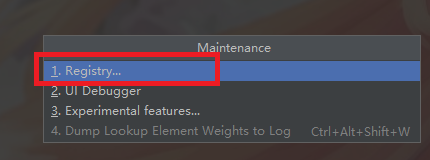

# SpringBoot开发热部署

### 首先导入SpringBoot开发工具集

```xml
<dependency>
    <groupId>org.springframework.boot</groupId>
    <artifactId>spring-boot-devtools</artifactId>
</dependency>
```


### 热部署模板引擎

1. 关闭模板引擎的缓存

   ```yaml
   spring:
     thymeleaf:
       cache: false
   ```

2. 修改完模板页面后按Ctrl + F9重新编译当前页面


### IDEA设置开发时热部署功能

按快捷键Ctrl + Alt + S进入设置，找到Build,Execution,Deployment下的Compiler并勾选Build project automatically然后保存


按快捷键Ctrl + Shift + Alt + / 弹出Maintenance 进入Registry...



勾选compiler.automake.allow.when.app.running，然后就开启了开发热部署，只要修改了代码保存会自动编译运行

