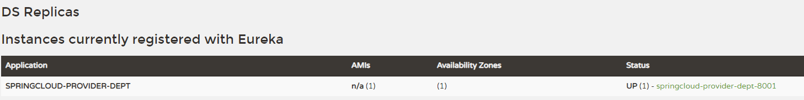
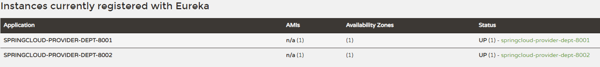
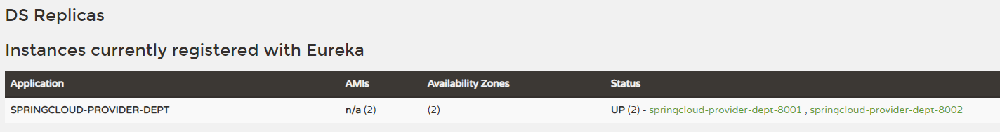

# Ribbon负载均衡

> 先把环境恢复为单注册中心的样子

**Ribbon配置的东西主要在consumer**

在consumer导入Ribbon和Eureka Client的依赖

```xml
<!-- Ribbon -->
<dependency>
    <groupId>org.springframework.cloud</groupId>
    <artifactId>spring-cloud-starter-netflix-ribbon</artifactId>
</dependency>
<!-- Eureka Client -->
<dependency>
    <groupId>org.springframework.cloud</groupId>
    <artifactId>spring-cloud-starter-netflix-eureka-client</artifactId>
</dependency>
```

编写配置

```yaml
eureka:
  client:
    register-with-eureka: false   # 不向Eureka注册自己
    service-url:
      defaultZone: http://localhost:7001/eureka/
```

controller：

```java
package org.example.controller;

import org.example.api.entity.Dept;
import org.springframework.beans.factory.annotation.Autowired;
import org.springframework.web.bind.annotation.*;
import org.springframework.web.client.RestTemplate;

import java.util.List;

@RestController
@RequestMapping("/consumer")
public class DeptConsumerController {

    @Autowired
    private RestTemplate restTemplate;

//    public static final String REST_URL_PREFIX = "http://localhost:8001";
    public static final String REST_URL_PREFIX = "http://SPRINGCLOUD-PROVIDER-DEPT";

    @GetMapping("/dept/{id}")
    public Dept get(@PathVariable("id") long id) {
        return restTemplate.getForObject(REST_URL_PREFIX + "/dept/query/" + id,
                Dept.class);
    }

    @GetMapping("/dept")
    public List<Dept> getAll() {
        return restTemplate.getForObject(REST_URL_PREFIX + "/dept/query",
                List.class);
    }

    @PostMapping("/dept/add")
    public boolean add(Dept dept) {
        return restTemplate.postForObject(REST_URL_PREFIX + "/dept/add",
                dept,
                Boolean.class);
    }

}
```

`REST_URL_PREFIX`应该要改成Application name了



Application 就是spring.application.name配置的名字的大写

> Ribbon和Eureka整合以后，客户端可以直接调用服务，不用关心IP地址和端口号


### 注册多个服务

将之前的provider复制多两份，连不同的数据库，应用名也改成不同的

暴露端口为8001，8002，8003

8001：

```yaml
server:
  port: 8001

mybatis:
  config-location: classpath:mybatis/mybatis-config.xml
  mapper-locations:
    - classpath:mybatis/mapper/dept_mapper.xml

spring:
  application:
    name: springcloud-provider-dept
  datasource:
    type: com.alibaba.druid.pool.DruidDataSource
    driver-class-name: com.mysql.cj.jdbc.Driver
    url: jdbc:mysql://10.10.10.246:3306/DB01?useUnicode=true&characterEncoding=utf-8
    username: root
    password: 123456

eureka:
  client:
    service-url:
      defaultZone: http://localhost:7001/eureka/
  instance:
    instance-id: springcloud-provider-dept-8001   # 修改status描述信息

# 展示在Eureka的Status的info信息
info:
  app.name: provider-springcloud-01
  company.name: test01  .com
```

8002：

```yaml
server:
  port: 8002

mybatis:
  config-location: classpath:mybatis/mybatis-config.xml
  mapper-locations:
    - classpath:mybatis/mapper/dept_mapper.xml

spring:
  application:
    name: springcloud-provider-dept
  datasource:
    type: com.alibaba.druid.pool.DruidDataSource
    driver-class-name: com.mysql.cj.jdbc.Driver
    url: jdbc:mysql://10.10.10.246:3306/DB02?useUnicode=true&characterEncoding=utf-8
    username: root
    password: 123456

eureka:
  client:
    service-url:
      defaultZone: http://localhost:7001/eureka/
  instance:
    instance-id: springcloud-provider-dept-8002   # 修改status描述信息

# 展示在Eureka的Status的info信息
info:
  app.name: provider-springcloud0-02
  company.name: test02.com
```

8003：

```yaml

server:
  port: 8003

mybatis:
  config-location: classpath:mybatis/mybatis-config.xml
  mapper-locations:
    - classpath:mybatis/mapper/dept_mapper.xml

spring:
  application:
    name: springcloud-provider-dept
  datasource:
    type: com.alibaba.druid.pool.DruidDataSource
    driver-class-name: com.mysql.cj.jdbc.Driver
    url: jdbc:mysql://10.10.10.246:3306/DB03?useUnicode=true&characterEncoding=utf-8
    username: root
    password: 123456

eureka:
  client:
    service-url:
      defaultZone: http://localhost:7001/eureka/
  instance:
    instance-id: springcloud-provider-dept-8003   # 修改status描述信息

# 展示在Eureka的Status的info信息
info:
  app.name: provider-springcloud-03
  company.name: test03.com
```

> `spring.application.name`要保持一致，因为都是提供同一种服务的，配置相同名字的效果就是注册中心的Application只有一个，Status就会有多个，这样在Consumer才可以用一个应用名负载均衡多个Provider（Consumer访问服务的url：http://<Application Name>/resource_path）
>
> 不同应用名效果：
>
> 
>
> 相同应用名效果：
>
> 


### 更换负载均衡算法

**开启Ribbon负载均衡后默认使用轮询算法**

负载均衡策略


* RoundRobinRule：轮询
* RandomRule：随机
* AvailabilityFilteringRule：会先过滤掉访问故障的服务，剩下的进行轮询
* RetryRule：先按照轮询获取服务，如果服务获取失败，则会在指定时间内重试


修改轮询策略：

只需要在配置类返回`IRule`接口就可以了

```java
@Configuration
public class BeanConfig {
    // 配置负载均衡实现
    @Bean
    @LoadBalanced
    public RestTemplate restTemplate() {
        return new RestTemplate();
    }

    @Bean
    public IRule iRule() {
        return new RandomRule();
    }

}
```


###  自定义负载均衡算法

定义配置类：

```java
package org.example.config;

import org.springframework.cloud.client.loadbalancer.LoadBalanced;
import org.springframework.context.annotation.Bean;
import org.springframework.context.annotation.Configuration;
import org.springframework.web.client.RestTemplate;

@Configuration
public class BeanConfig {
    // 配置负载均衡实现
    @Bean
    @LoadBalanced
    public RestTemplate restTemplate() {
        return new RestTemplate();
    }

}
```

在微服务启动的时候就能去加载自定义的Ribbon类：

```java
package org.example;

import org.example.config.MyRule;
import org.springframework.boot.SpringApplication;
import org.springframework.boot.autoconfigure.SpringBootApplication;
import org.springframework.cloud.netflix.eureka.EnableEurekaClient;
import org.springframework.cloud.netflix.ribbon.RibbonClient;

@SpringBootApplication
@EnableEurekaClient
// 在微服务启动的时候就能去加载自定义的Ribbon类
@RibbonClient(name = "SPRINGCLOUD-PROVIDER-DEPT", configuration = {MyRule.class})
public class DeptConsumer80 {

    public static void main(String[] args) {
        SpringApplication.run(DeptConsumer80.class, args);
    }

}
```

继承`AbstractLoadBalancerRule`实现轮询算法（直接复制Ribbon提供的自己修改）：

比如有两个服务，每个服务提供五次：

```java
package org.example.config;

import com.netflix.client.config.IClientConfig;
import com.netflix.loadbalancer.AbstractLoadBalancerRule;
import com.netflix.loadbalancer.ILoadBalancer;
import com.netflix.loadbalancer.Server;

import java.util.List;

public class MyRandomRule extends AbstractLoadBalancerRule {

    private int total = 0;      // 服务调用次数
    private int index = 0;      // 当前谁在提供服务

    public Server choose(ILoadBalancer lb, Object key) {
        if (lb == null) {
            return null;
        }
        Server server = null;

        while (server == null) {
            if (Thread.interrupted()) {
                return null;
            }
            List<Server> upList = lb.getReachableServers();     // 获得还活着的服务
            List<Server> allList = lb.getAllServers();          // 获得全部的服务

            int serverCount = allList.size();
            if (serverCount == 0) {
                return null;
            }

            if (total++ >= 5) {             // 每个服务轮询五次
                total = 0;
                index = (index + 1) % serverCount;
            }
            server = upList.get(index);

            if (server == null) {
                Thread.yield();
                continue;
            }

            if (server.isAlive()) {
                return (server);
            }

            server = null;
            Thread.yield();
        }

        return server;

    }

    @Override
    public Server choose(Object key) {
        return choose(getLoadBalancer(), key);
    }

    @Override
    public void initWithNiwsConfig(IClientConfig clientConfig) {
        // TODO Auto-generated method stub

    }
}
```

在配置类中添加这个bean：

```java
package org.example.config;

import com.netflix.loadbalancer.IRule;
import org.springframework.context.annotation.Bean;
import org.springframework.context.annotation.Configuration;

@Configuration
public class MyRule {
    @Bean
    public IRule iRule() {
        return new MyRandomRule();
    }
}

```

