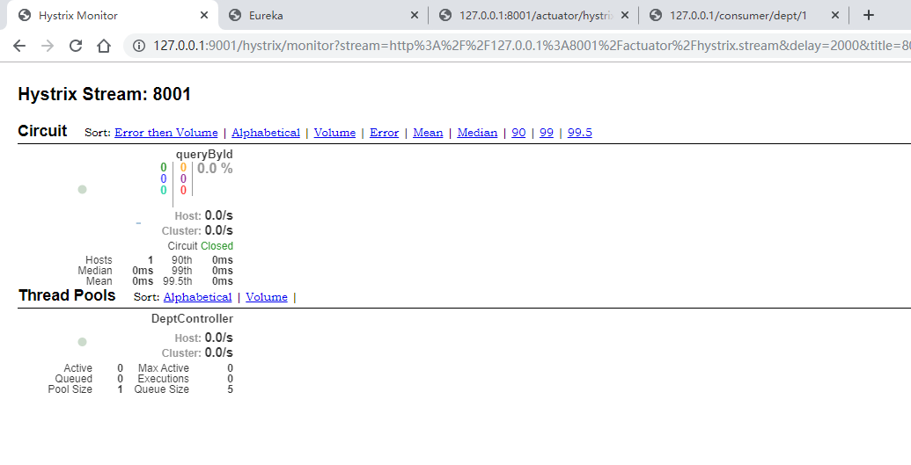

# Hystrix服务熔断

拷贝一份Provider项目，让这个项目具有容灾

导入Hystrix依赖：

```xml
<!-- Hystris依赖 -->
<dependency>
    <groupId>org.springframework.cloud</groupId>
    <artifactId>spring-cloud-starter-netflix-hystrix</artifactId>
</dependency>
```

Status在数鼠标hover时浏览器不显示ip地址，为true显示ip
```properties
eureka.instance.prefer-ip-address=false
```


在Controller编写备用方法和设置备用方法：

`@HystrixCommand`注解用来设置失败后的操作

```java
@RestController
@RequestMapping("/dept")
public class DeptController {

    @Autowired
    private DeptService deptService;

    @PostMapping("/add")
    public boolean addDept(Dept dept) {
        return deptService.addDept(dept);
    }

    @GetMapping("/query/{id}")
    @HystrixCommand(fallbackMethod = "hystrixQueryAll")
    public Dept queryById(@PathVariable("id") long id) {
        Dept dept = deptService.queryById(id);
        if (dept == null) {
            throw new RuntimeException("no id " + id + " dept");
        }
        return dept;
    }

    @GetMapping("/query")
    public List<Dept> queryAll() {
        return deptService.queryAll();
    }

    // queryAll备选方案
    public Dept hystrixQueryAll(long id) {
        return new Dept()
                .setDeptId(-1)
                .setDeptName(id + " is not exists!")
                .setDbSource("not exists");
    }

}
```

> **此时在Consumer就要判断返回值了**

配置开启熔断保险丝：

`@EnableCircuitBreaker`开启断路保护

```java
@Configuration
@EnableCircuitBreaker
public class HystrixConfig {
}
```


> 服务熔断实在Provider端的操作
>
> 下面的服务降级是在Consumer操作	


# Hystrix服务降级

> 服务降级就是在高并发环境下为了得到更多性能处理A，而把B，C服务关掉了，就要有一种机制告诉别人服务关闭了（服务降级）


在api中添加降级的类，这个类要和Feign定义的服务接口产生关系：

```java
@Component
public class DeptClientServiceFallbackFactory implements FallbackFactory<DeptClientService> {
    @Override
    public DeptClientService create(Throwable cause) {
        return new DeptClientService() {
            @Override
            public Dept queryById(long id) {
                return new Dept()
                        .setDeptId(-2)
                        .setDeptName("降级信息：这个服务被关闭了")
                        .setDbSource("service shutdown");
            }

            @Override
            public List<Dept> queryAll() {
                return new ArrayList<Dept>();
            }

            @Override
            public boolean addDept(Dept dept) {
                return false;
            }
        };
    }
}
```

service接口设置fallback类：

`@FeignClient`的`fallbackFactory`属性设置fallback类

```java
@Service
@FeignClient(value = "SPRINGCLOUD-PROVIDER-DEPT", fallbackFactory = DeptClientServiceFallbackFactory.class)
public interface DeptClientService {
    @GetMapping("/dept/query/{id}")
    Dept queryById(@PathVariable("id") long id);
    @GetMapping("/dept/query")
    List<Dept> queryAll();
    @PostMapping("/dept/add")
    boolean addDept(Dept dept);
}
```

在前面的Feign项目中开启feign服务降级：

修改application.yml

```yml
# 开启feign服务降级
feign:
  hystrix:
    enabled: true
```


> 服务降级是i在客户端做的
>
> 服务熔断是在服务端做的


# 服务熔断和服务降级的区别

### 服务熔断

 服务熔断的作用类似于我们家用的保险丝，当某服务出现不可用或响应超时的情况时，为了防止整个系统出现雪崩，暂时停止对该服务的调用

### 服务降级

服务降级是从整个系统的负荷情况出发和考虑的，对某些负荷会比较高的情况，为了预防某些功能（业务场景）出现负荷过载或者响应慢的情况，在其内部暂时舍弃对一些非核心的接口和数据的请求，而直接返回一个提前准备好的fallback（退路）错误处理信息。这样，虽然提供的是一个有损的服务，但却保证了整个系统的稳定性和可用性

### 熔断VS降级

 相同点： 

*  目标一致 都是从可用性和可靠性出发，为了防止系统崩溃 
*  用户体验类似 最终都让用户体验到的是某些功能暂时不可用 

 不同点：

*  触发原因不同 服务熔断一般是某个服务（下游服务）故障引起，而服务降级一般是从整体负荷考虑 


# Hystrix Dashboard流控

新建一个工程hystrix dashboard

导入依赖：

```xml
<?xml version="1.0" encoding="UTF-8"?>

<project xmlns="http://maven.apache.org/POM/4.0.0" xmlns:xsi="http://www.w3.org/2001/XMLSchema-instance"
  xsi:schemaLocation="http://maven.apache.org/POM/4.0.0 http://maven.apache.org/xsd/maven-4.0.0.xsd">
  <modelVersion>4.0.0</modelVersion>

  <parent>
    <groupId>org.springframework.boot</groupId>
    <artifactId>spring-boot-starter-parent</artifactId>
    <version>2.2.4.RELEASE</version>
    <relativePath/> <!-- lookup parent from repository -->
  </parent>

  <artifactId>springcloud-hystrix-dashboard-9001</artifactId>
  <groupId>org.example</groupId>
  <version>1.0-SNAPSHOT</version>

  <name>springcloud-hystrix-dashboard-9001</name>
  <!-- FIXME change it to the project's website -->
  <url>http://www.example.com</url>

  <properties>
    <project.build.sourceEncoding>UTF-8</project.build.sourceEncoding>
    <maven.compiler.source>1.8</maven.compiler.source>
    <maven.compiler.target>1.8</maven.compiler.target>
  </properties>

  <dependencies>
    <!-- junit -->
    <dependency>
      <groupId>junit</groupId>
      <artifactId>junit</artifactId>
      <scope>test</scope>
    </dependency>

    <!-- hystrix -->
    <dependency>
      <groupId>org.springframework.cloud</groupId>
      <artifactId>spring-cloud-starter-netflix-hystrix</artifactId>
      <version>2.2.2.RELEASE</version>
    </dependency>

    <!-- hystrix dashboard -->
    <dependency>
      <groupId>org.springframework.cloud</groupId>
      <artifactId>spring-cloud-starter-netflix-hystrix-dashboard</artifactId>
      <version>2.2.2.RELEASE</version>
    </dependency>
    <!-- springboot web -->
    <dependency>
      <groupId>org.springframework.boot</groupId>
      <artifactId>spring-boot-starter-web</artifactId>
    </dependency>
    <!-- springboot -->
    <dependency>
      <groupId>org.springframework.boot</groupId>
      <artifactId>spring-boot-starter</artifactId>
    </dependency>


  </dependencies>

  <build>
    <pluginManagement><!-- lock down plugins versions to avoid using Maven defaults (may be moved to parent pom) -->
      <plugins>
        <!-- clean lifecycle, see https://maven.apache.org/ref/current/maven-core/lifecycles.html#clean_Lifecycle -->
        <plugin>
          <artifactId>maven-clean-plugin</artifactId>
          <version>3.1.0</version>
        </plugin>
        <!-- default lifecycle, jar packaging: see https://maven.apache.org/ref/current/maven-core/default-bindings.html#Plugin_bindings_for_jar_packaging -->
        <plugin>
          <artifactId>maven-resources-plugin</artifactId>
          <version>3.0.2</version>
        </plugin>
        <plugin>
          <artifactId>maven-compiler-plugin</artifactId>
          <version>3.8.0</version>
        </plugin>
        <plugin>
          <artifactId>maven-surefire-plugin</artifactId>
          <version>2.22.1</version>
        </plugin>
        <plugin>
          <artifactId>maven-jar-plugin</artifactId>
          <version>3.0.2</version>
        </plugin>
        <plugin>
          <artifactId>maven-install-plugin</artifactId>
          <version>2.5.2</version>
        </plugin>
        <plugin>
          <artifactId>maven-deploy-plugin</artifactId>
          <version>2.8.2</version>
        </plugin>
        <!-- site lifecycle, see https://maven.apache.org/ref/current/maven-core/lifecycles.html#site_Lifecycle -->
        <plugin>
          <artifactId>maven-site-plugin</artifactId>
          <version>3.7.1</version>
        </plugin>
        <plugin>
          <artifactId>maven-project-info-reports-plugin</artifactId>
          <version>3.0.0</version>
        </plugin>
      </plugins>
    </pluginManagement>
  </build>
</project>
```

> # 大坑
>
> 按照原来的方法，在父项目下创建的dashboard，使用父项目的依赖管理，导入的dashboard一直报错，现在是新建一个springboot项目，使用springboot的parent，在导入dashboard就不会报错
>
> ```xml
> <parent>
>     <groupId>org.springframework.boot</groupId>
>     <artifactId>spring-boot-starter-parent</artifactId>
>     <version>2.2.4.RELEASE</version>
>     <relativePath/> <!-- lookup parent from repository -->
> </parent>
> ```
>
> 


修改启动端口：

```yaml
server:
  port: 9001
```


Provider要有监控信息的依赖：

```xml
<!-- 完善监控信息 -->
<dependency>
<groupId>org.springframework.boot</groupId>
<artifactId>spring-boot-starter-actuator</artifactId>
</dependency>
```


Hystrix Dashboard编写启动类：

```java
@SpringBootApplication
@EnableHystrixDashboard
public class DeptConsumerDashboard9001 {

    public static void main(String[] args) {
        SpringApplication.run(DeptConsumerDashboard9001.class, args);
    }

}
```


Provider配置监控信息：

导入hystrix

```xml
<!-- Hystrix依赖 -->
<dependency>
    <groupId>org.springframework.cloud</groupId>
    <artifactId>spring-cloud-starter-netflix-hystrix</artifactId>
</dependency>
```


Provider配置Servlet，用来之后Hystrix访问：

```java
@Bean
public ServletRegistrationBean hystrixMetricsStreamServlet() {
    ServletRegistrationBean bean = new ServletRegistrationBean(new HystrixMetricsStreamServlet());
    bean.addUrlMappings("/actuator/hystrix.stream");       // 访问的监控页面
    return bean;
}
```


> ### **坑**
>
> 访问Provider的`/actuation/hystrix.stream`一直ping，hystrix dashboard一直loading，这不是bug，是没有消费服务
>
> 解决办法：
>
> 1. 创建另外一个服务
>
> 2. 在这个服务写一个接口，通过Feign访问Provider
>
>    
>
> 3. RestTemplate不行，一定要Feign
>
> 4. 调用多次Feign访问后就会有正常的数据了
>
> 

之后把Provider的`/actuation/hystrix.stream`配置到hystrix dashboard页面就可以了

添加监控的provider


监控页面：



不同颜色数字代表的请求状态

